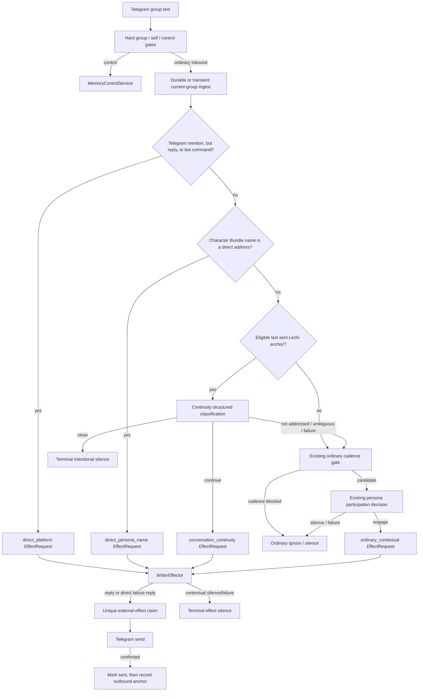

# Technical Design: 乐枝对话连续性触发 v0.2

- Status: Approved for implementation
- Feature: `lezhi-conversation-triggers-v0-2`
- Requirements input: `1e467fe7942ae057424e8600eb493759d4bc456c`
- Requirements handoff: `b98e47b6e4d49709c7e9d6d0477130da37caa92cd5fc3432ae6f17e7c85960e6`
- Baseline implementation: `7c73ca0f809643a2e83362922212a05f843b694d`
- Written: 2026-07-31

## 1. Design Outcome

This change extends the existing trigger pipeline without changing the Writer, member-memory,
tool-budget, group-isolation, or single-external-effect contracts.

The application will add two responsive trigger mechanisms ahead of ordinary proactive
participation:

1. a deterministic, high-precision persona-name address matcher whose initial vocabulary is
   derived from the immutable Character Bundle formal name (`乐枝`); and
2. a bounded conversation-continuity classifier that considers only the latest successfully
   sent Lezhi message in the current group, within ten minutes and no more than five subsequent
   human messages.

The continuity model returns one of four application-owned outcomes: continue, natural close,
not addressed, or ambiguous. Only continue creates a continuity effect request. Natural close
is terminal silence. Not-addressed, ambiguous, invalid, unavailable, and timed-out results fall
back to the existing ordinary participation evaluation and its 15-minute/five-human-message
cadence. This preserves the confirmed conservative failure boundary.

## 2. Existing Boundaries Reused

- `TelegramAdapter` remains responsible only for normalizing Telegram group text, mentions,
  replies, commands, stable identifiers, and timestamps. Plain persona names are not Telegram
  entities and therefore remain an application trigger concern.
- `CharacterBundle` remains the immutable source for Trigger, Recognition, and Effector views.
- `MessageRepository` remains the source of at most twenty current-group messages. Outbound bot
  messages enter it only after Telegram confirms a send.
- `RunRepository` remains the owner of trigger/effect/tool/control audit and external-effect
  claims.
- `WriterEffector` keeps the existing three-model-call/two-tool-call ceilings and direct versus
  contextual failure behavior.
- `PersonaMessageProcessor` keeps durable ingestion before model work, replay recovery before an
  external-effect claim, and at-most-once sending after the claim.

## 3. Component Design

### 3.1 Character Bundle address vocabulary

`CharacterBundle` gains an immutable `direct_address_terms` tuple compiled from
`identity_and_stable_facts.name`. For `lezhi-v1.0` the only term is `乐枝`.

The tuple is derived from already-digested character content, so it cannot disagree with the
bundle snapshot. Group text, member memory, model output, and runtime commands cannot add terms.
Future aliases require an explicit Character Bundle schema/version change; v0.2 does not learn
aliases from conversation.

### 3.2 `PersonaAddressMatcher`

A new pure module owns Unicode normalization and high-precision address classification. Its
result contains only:

```text
match_kind       none | direct | mention_only
reason_code      stable application reason
matched_term     optional configured term, used in memory only
```

The matcher recognizes:

- a standalone configured name;
- a configured name used as a sentence-opening vocative with normal Chinese/ASCII punctuation
  or spacing;
- a configured name used as a sentence-ending vocative after an utterance boundary;
- compact sentence-opening requests whose first lexical unit clearly addresses the named
  persona.

It does not elevate:

- a name inside balanced quotation marks;
- possessive, reported-speech, historical-reference, or third-person name use;
- a mid-sentence name with no address boundary;
- a list item or text directed to another named member;
- malformed or ambiguous name placement.

An uncertain match returns `mention_only`, which continues through ordinary trigger evaluation.
The matcher is deterministic so a confirmed name address never depends on provider availability.

### 3.3 `ConversationContinuityGate`

This application-owned gate receives the current message, current time, bot user ID, and the
current group's recent scene after inbound ingestion. It selects only the most recent stored
outbound message authored by the configured bot. Such messages exist only after a successful
Telegram send.

An anchor is eligible only when all conditions hold:

- it belongs to the current group;
- its direction is outbound and sender is the authenticated bot;
- its send time is not in the future and is at most ten minutes old;
- no more than five human inbound messages occur after it, including the current message;
- its retained text is available in the recent twenty-message scene.

Eligibility is not semantic proof. It only permits a bounded model classification. If no anchor
is eligible, processing proceeds directly to the existing ordinary cadence gate.

### 3.4 `ConversationContinuityDecider`

This class uses the existing Trigger model role, five-second bounded deadline, zero tools,
temperature zero, the exact Character Bundle Trigger view, the eligible anchor, the current
message, and the current-group recent scene. It receives an exact response schema owned by the
application:

```json
{
  "kind": "continue | close | not_addressed | ambiguous",
  "reason_code": "snake_case"
}
```

Definitions supplied by the application, not group text:

- `continue`: the current message answers the anchor's question, accepts or rejects its
  suggestion, reacts to its observation or joke, asks a follow-up, or continues its invitation.
- `close`: the message relates to the anchor but contains only acknowledgement, thanks, laughter,
  or another natural ending with no new request or information requiring a response.
- `not_addressed`: content is unrelated, clearly directed to another member, or merely discusses
  or quotes Lezhi.
- `ambiguous`: two or more addressees are comparably plausible or evidence is insufficient.

Time adjacency alone is explicitly insufficient. Group content is wrapped as untrusted data and
cannot alter the schema, definitions, Character Bundle, eligibility window, priority, or safety
rules. The parser rejects extra fields, unknown kinds, invalid reason codes, prose, and protocol
text.

### 3.5 Trigger coordinator

The coordinator applies one stable priority order:

1. other-group, self-message, and memory-control gates;
2. Telegram mention, native reply to the bot, or non-control bot command;
3. deterministic Character Bundle name address;
4. eligible conversation-continuity classification;
5. existing ordinary proactive cadence and persona participation decision.

The final trigger category is separate from failure semantics:

```text
direct_platform
direct_persona_name
conversation_continuity
ordinary_contextual
control
ignored
```

`direct_platform` and `direct_persona_name` use the existing direct effect path, including its
single neutral failure reply. `conversation_continuity` and `ordinary_contextual` use the existing
contextual effect failure semantics, so model/Writer failure is silent. The distinct category is
carried into audit and effect-run metadata; continuity is never recorded as ordinary proactive
participation.

### 3.6 Context assembly

`TriggerContext` gains an optional continuity anchor selected from the same recent-scene tuple.
The model receives stable message IDs, sender IDs, direction, timestamps, and currently retained
text for the anchor and recent scene. It receives no private chat, other-group text, unsent Writer
candidate, expired text, hidden chain of thought, or additional long-term transcript.

Member recognition remains available under its existing rules. The new trigger does not broaden
who is loaded, source scope, retention, or tool access.

### 3.7 Audit and database migration

Migration 2 adds:

- `effect_runs.trigger_category`, backfilled from the existing direct/contextual path; and
- `trigger_evaluations`, one upserted final evaluation per `(chat_id, trigger_event_id)`.

`trigger_evaluations` stores only:

```text
request_id
chat_id / trigger_event_id / trigger_message_id
trigger_category
persona_name_hit
continuity_anchor_message_id (nullable)
decision_kind
reason_code
model_status
persona_id / version / digest
created_at / updated_at
```

It stores no message text, prompt, model body, confidence, private reasoning, member-memory value,
or provider response. Existing `trigger_runs` continue to record individual structured Trigger
model calls; final evaluation audit resolves which path ultimately won after fallback.

## 4. End-to-End Flow



## 5. State, Retry, and Idempotency

- Inbound ingestion remains idempotent by current-group event ID.
- A final trigger audit with `effect_requested` is non-terminal. A restart before an external-effect
  claim may safely recompute the trigger and Writer run.
- A final trigger audit representing natural close or final ignore/silence is terminal for replay;
  it does not send and does not repeatedly call the model.
- Existing completed Writer silence remains terminal through `effect_runs`.
- Once an external-effect row is claimed, replay cannot send a second reply, regardless of how
  many trigger signals matched.
- A send timeout or uncertain transport result remains terminal-uncertain and is never blindly
  retried.
- Only a confirmed Telegram send becomes a future continuity anchor.

## 6. Failure and Degradation Contract

| Failure | Application behavior | Group-visible effect |
| --- | --- | --- |
| Persona name is present but address syntax is uncertain | Treat as mention-only and continue ordinary evaluation | None unless ordinary path later engages |
| No eligible anchor | Skip continuity model and continue ordinary evaluation | None unless ordinary path later engages |
| Anchor disappears or text expires before assembly | Record safe degradation and continue ordinary evaluation | None unless ordinary path later engages |
| Continuity timeout, provider error, invalid JSON/schema, or snapshot mismatch | Record model failure and continue ordinary evaluation | No continuity failure message |
| Continuity returns `close` | Record intentional terminal silence | None |
| Continuity returns unrelated or ambiguous | Continue ordinary evaluation | None unless ordinary path later engages |
| Explicit platform/name direct Writer failure | Existing one-time neutral direct failure reply | At most one |
| Continuity/ordinary Writer failure | Existing contextual silence | None |
| Database failure before external-effect claim | Processing fails; replay may recompute | No duplicate send |
| Telegram send uncertain after claim | Mark uncertain; do not retry blindly | At most one actual send |

## 7. Security and Privacy

- Address terms are application data compiled from the authenticated Character Bundle, never
  learned from untrusted messages.
- Group text cannot request a new alias, widen ten minutes/five messages, change priority, or
  disable safety.
- Continuity scope is current group only and is anchored by an outbound record created after a
  confirmed send.
- The model sees at most the existing twenty retained current-group texts. No retention duration
  or memory category changes.
- No model confidence, chain of thought, prompt, full provider response, or message text is added
  to durable trigger audit.
- Character Bundle id/version/digest are rechecked across Trigger and Effect requests.
- One external effect per inbound event remains enforced by the existing unique database key.

## 8. Compatibility, Rollout, and Rollback

- No Telegram Bot API, command, tool, public Python API, or operator credential changes are
  required.
- Existing explicit mentions, native replies, bot commands, ordinary cadence, fixed mode, and
  memory controls retain their current behavior.
- `persona_direct` enables platform and persona-name direct responses and continuity responses,
  but still excludes ordinary proactive participation. `persona_full` enables all paths.
- The ten-minute/five-message window and initial formal-name vocabulary are confirmed product
  constants, constructor-injectable only for deterministic tests; no group message can configure
  them.
- Database migration is additive. Rollback to the previous binary ignores the new audit table and
  column; it reverts behavior to platform-direct plus ordinary contextual triggers without
  deleting retained data.
- Deployment keeps the current feature flag boundary (`BOT_MODE`). Operational activation and
  real-group UAT remain separate from code correctness and require operator-owned credentials.

## 9. Verification Strategy

### Deterministic unit and contract tests

- Character Bundle formal-name compilation, snapshot binding, and future-alias non-acceptance.
- Address matcher positive variants: sentence start/end, Chinese/ASCII punctuation, spacing,
  direct compact request, and standalone name.
- Address matcher negatives: third-person discussion, historical reference, quote, possessive,
  another-member address, list, and injection text.
- Continuity eligibility at exact ten-minute and five-human-message boundaries; reject expired,
  future, missing-text, other-group, unsent, and sixth-human-message anchors.
- Exact continuity prompt/schema/parser agreement for all four decisions and extra-field rejection.
- Continue, natural close, unrelated fallback, ambiguity fallback, timeout fallback, and invalid
  result fallback.
- Priority and single-path tests for control plus name, Telegram mention plus name, and duplicate
  signals.
- Replay tests before/after final trigger audit, Writer completion, external-effect claim, send,
  and outbound recording.
- Audit tests prove category, name-hit flag, actual anchor ID, decision, degradation reason, and
  persona snapshot without content fields.

### Integration and regression tests

- End-to-end direct-name reply bypasses ordinary cadence and calls no participation classifier.
- End-to-end answer/follow-up continuity bypasses ordinary cadence and sends at most one reply.
- Natural-close continuity remains silent and replay does not re-call the model.
- Unrelated or ambiguous messages retain original 15-minute/five-human cadence.
- Cross-group and self-message cases remain ignored.
- All existing persona, memory, control, Writer, package, Telegram, and fixed-mode tests pass.

### Release evidence

- compileall, full unittest discovery, Ruff check/format, Mypy, package build, installed entry point,
  shell syntax, Compose rendering, credential scan, and Docker image build when the daemon is
  available.
- A scripted AC-001 through AC-015 matrix is the deterministic release carrier.
- Real Telegram group proof is deferred until an exact reviewed head is available and the operator
  supplies authorized group messages and provider/Telegram credentials.

## 10. Requirements Traceability

| Design area | Requirements / acceptance criteria |
| --- | --- |
| Bundle-derived address terms and high-precision matcher | REQ-001–005, REQ-016, REQ-020; AC-001, AC-002, AC-011, AC-014 |
| Eligible actual outbound anchor and current-group scene | REQ-006–010, REQ-013; AC-003, AC-004, AC-006–008 |
| Four-way continuity decision and ordinary fallback | REQ-007, REQ-008, REQ-010–013, REQ-018; AC-003–007, AC-013 |
| Priority, category, and effect failure semantics | REQ-005, REQ-010, REQ-014, REQ-019; AC-009, AC-013 |
| Idempotency and external-effect claim | REQ-015; AC-010 |
| Minimal trigger audit | REQ-017; AC-012 |
| Character, memory, tools, safety, and group boundaries | REQ-009, REQ-016, REQ-020; AC-008, AC-011, AC-014 |
| Full deterministic scenario matrix | REQ-001–020; AC-015 |

## 11. Deferred Scope

- Meal recommendation remains outside this feature.
- Learned nicknames, administrator alias commands, media/private-chat triggers, longer transcript
  windows, cross-group continuity, and provider-specific tuning are not implemented.
- Independent persona-quality scoring and operator-owned real-group UAT are release follow-ups,
  not substitutes for the deterministic acceptance matrix.
