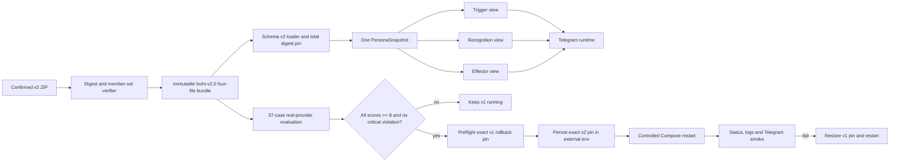

# Technical Design: 乐枝人格 v2 发布与低频版本管理

- Status: Approved for implementation
- Feature: `lezhi-persona-v2-release`
- Requirements input: `25eacf0c81fb903f131ffa5b113b1740d0cf4512`
- Requirements handoff: `48d7910e4afefc7854dcfaab227e3880bacac102f24ac23877df8c07856ef820`
- Baseline: `4f50c14e748afd00c097393c0fa481184c006e12`
- Written: 2026-08-02

## 1. Design Outcome

The release adds an immutable `lezhi-v2.0` Character Bundle next to the unchanged
`lezhi-v1.0` bundle. It extends the bundle loader with manifest schema version 2 so the three
confirmed source files can be preserved byte-for-byte while their original ZIP/file digests and
requirements handoff remain auditable. A schema-aware compiler derives Trigger, Recognition and
Effector views from the same parsed character object and the same `PersonaSnapshot`.

Activation remains an operator-owned deployment choice: an exact bundle directory and content
digest are stored in the existing external Compose environment. The release command validates
the candidate, validates the recorded v1 rollback bundle, verifies deterministic tests and the
real-provider evaluation report, then performs the existing Compose restart without deleting the
named data volume. Failure before restart leaves v1 running; failed startup or Telegram smoke
restores the recorded v1 pin and restarts once.

### Requirements revision coordination

The accepted requirements revision changes only the confirmed source JSON SHA-256 from an
invalid 65-character transcription to the verified 64-character value
`600fed847d362f272739d6613874aac857e339c02bc76c18619d104280dbbfcc`, plus confirmation and
supersession metadata. Product behavior, acceptance criteria, assumptions and decisions are
unchanged. The design remains valid and now binds to the revised handoff above.

## 2. Source and Production Artifact Contract

The confirmed source archive contains exactly:

```text
lezhi-persona-v2.json
evaluation-cases.jsonl
examples.jsonl
```

The importer is intentionally a low-frequency, explicit operation. It verifies the confirmed ZIP
and member SHA-256 values before writing a candidate. The production directory is:

```text
src/group_llm_agent/persona_bundles/lezhi/lezhi-v2.0/
  manifest.json
  character.json
  evaluation-cases.jsonl
  examples.jsonl
```

`character.json`, `evaluation-cases.jsonl`, and `examples.jsonl` retain the confirmed source bytes
exactly. `manifest.json` is canonical JSON and records:

- schema version 2;
- normalized runtime identity `lezhi` / `lezhi-v2.0`;
- the application content digest;
- the confirmed requirements commit and handoff reference;
- the provider-evaluation carrier path;
- the source ZIP SHA-256 and exact SHA-256 for each of the three source files.

The application content digest continues to cover the manifest without its self-referential
digest plus all three production files, including their names and lengths. Content changes under
the same version therefore fail both the manifest check and the deployment pin.

Schema version 1 stays byte- and behavior-compatible for `lezhi-v1.0`. Schema version 2 rejects
unknown/missing manifest fields, unknown/missing character top-level fields, a source digest that
does not match the production file, duplicate JSON keys, invalid identity/version mapping,
noncanonical manifest data, invalid JSONL, unsafe paths, symlinks, or unexpected files.

## 3. Schema v2 Character Validation

The v2 source owns these nineteen normative top-level fields:

```text
persona_meta
behavior_priority
attention_and_interest
core_traits
dramatic_engine
taste_and_bias
identity_and_stable_facts
conversational_impulses
humor_engine
state_and_continuity
anti_assistant_defaults
member_salience
preference_evolution
relationship_stance
participation_and_silence_rules
situational_behavior
voice_and_interaction_style
negative_and_safety_rules
behavioral_examples
```

The loader requires the exact set. It recursively validates that the contract contains only JSON
objects, arrays, strings, numbers, booleans and null; bounds nesting, collection sizes, text sizes
and total bytes; rejects control characters in identity text; and requires every normative section
to be non-empty. `persona_meta.id` must equal the manifest persona ID, `persona_meta.version=2.0`
must normalize exactly to `lezhi-v2.0`, and `persona_meta.name` must equal
`identity_and_stable_facts.name`.

The 37 evaluation and example lines must use the existing exact four-field contracts. Both sets
must contain exactly `CB-EVAL-001` through `CB-EVAL-037`, once each, with a one-to-one ID match.
Every evaluation pass condition must retain the `8/10` threshold and every example must carry
non-empty expected and forbidden behavior.

## 4. Three-View Compilation

All views carry the same immutable persona ID, normalized version and content digest. The compiler
uses application-owned field tuples so field loss is directly testable.

| Source field | Trigger | Recognition | Effector |
| --- | --- | --- | --- |
| `persona_meta` | yes | yes | yes |
| `behavior_priority` | yes | yes | yes |
| `attention_and_interest` | yes | no | yes |
| `core_traits` | yes | yes | yes |
| `dramatic_engine` | yes | yes | yes |
| `taste_and_bias` | yes | yes | yes |
| `identity_and_stable_facts` | yes | yes | yes |
| `conversational_impulses` | yes | no | yes |
| `humor_engine` | yes | yes | yes |
| `state_and_continuity` | yes | yes | yes |
| `anti_assistant_defaults` | yes | no | yes |
| `member_salience` | no | yes | yes |
| `preference_evolution` | no | yes | yes |
| `relationship_stance` | yes | yes | yes |
| `participation_and_silence_rules` | yes | no | yes |
| `situational_behavior` | yes | no | yes |
| `voice_and_interaction_style` | no | no | yes |
| `negative_and_safety_rules` | yes | yes | yes |
| `behavioral_examples` | no | no | yes |

Trigger receives the fields that govern identity, participation, humor, state, taste, boundaries
and whether an authentic reaction exists. Recognition receives fields that govern identity,
salience, revisable relationships/preferences, humor familiarity, state and safety. Effector
receives the complete normative contract plus all 37 external examples. No view can carry a
different snapshot.

## 5. Runtime Data Flow



Startup loads and validates the bundle before constructing the Telegram client, calling `getMe`,
starting polling, or sending an external effect. Successful startup logs only persona ID, version
and digest in addition to existing safe service events; it never logs character content, prompts,
provider bodies, member memory or credentials.

## 6. Memory Transition

No database migration is required. The existing repository already stores `fact`, `observation`
and `shared_experience` without persona fields, while `impression` and `preference` require and
store an exact persona version and digest. Activating v2 updates the group policy's active snapshot
without deleting any memory:

- neutral facts/observations/shared public experiences remain eligible under the existing group,
  policy, confidence, source and retention checks;
- v1 impressions and preferences fail the exact v2 version/digest filter;
- rows missing the required subjective persona binding remain ineligible;
- new v2 subjective recognition is written with the v2 snapshot.

Regression tests prove this transition and prove v1 data remains available again after rollback.

## 7. Provider Evaluation Contract

A repository script runs exactly 37 bounded cases against the same bundle pin and the exact
OpenAI-compatible model/provider configuration intended for deployment. It never prints the API
key or Base URL. For each case it records:

- case ID and dimension;
- persona ID/version/digest;
- provider label and model ID (not credentials or endpoint);
- generation temperature/token limits and timestamp;
- reply text or auditable silence;
- a structured 0–10 score;
- explicit critical-prohibition violations;
- reviewer identity and rationale.

Candidate generation uses the exact compiled Effector policy and examples. The model returns the
same application-owned reply/silence JSON shapes used by the Writer boundary. A separate bounded
judge call receives only the case contract and candidate output, returns an exact scoring schema,
and is identified as `provider_model_judge:<model>`. The evidence file is atomic: interruption or
any invalid result leaves no passing report. The command exits nonzero unless every case is at
least 8 and every critical case has zero violations.

The activation preflight independently reloads the evidence, confirms all 37 IDs once, matches the
candidate persona/model/generation configuration, and checks the pass condition. Scripted unit
models prove protocol behavior only and cannot create a passing release report.

## 8. Release State, Restart and Rollback

The current external Compose environment remains the persistent release selector. The repository
adds an operator command that accepts explicit candidate/rollback pins and an evaluation report;
it does not discover `latest`, edit a remote host, or delete volumes.

Preflight, before stopping v1:

1. render the current Compose configuration and identify the one repository service;
2. read the current non-secret persona path/digest/model IDs as the rollback record;
3. validate the exact v1 bundle and confirm the running container/image and named volume;
4. validate v2, its source traceability, deterministic suite and provider report;
5. write a redacted local release record under `deploy/state/` (gitignored), never a secret copy.

Activation updates only `PERSONA_BUNDLE_PATH` and `PERSONA_EXPECTED_SHA256` in the operator-owned
environment, then calls the existing Compose build/restart path. The named database volume is
never passed to `down --volumes` or removed. Status and bounded logs must show a running container
and the exact v2 identity/digest.

Telegram smoke is observational and message-bounded: after restart, the operator sends one direct
message in the configured group. The verifier waits for one newly ingested event and accepts at
most one matching external effect (`sent` or intentional silence). A duplicate effect, wrong
snapshot, startup failure, timeout, or missing ingestion fails the release.

On failure, the command restores the exact recorded v1 path/digest in the same environment,
restarts the same Compose service, validates v1 startup and records the failure/rollback result.
If rollback fails, it stops further mutation and reports the existing container state and manual
recovery entry without touching the data volume.

## 9. Failure, Retry and Concurrency

| Failure | Behavior |
| --- | --- |
| Source ZIP/member digest mismatch | Abort import; create no production bundle |
| Bundle schema/file/version/digest mismatch | Fail before Telegram/model I/O |
| Missing/duplicate evaluation/example ID | Fail bundle load and evaluation |
| Provider timeout/rate limit/invalid protocol | Mark evaluation failed; do not activate |
| Any score below 8 or critical violation | Preserve v1 and exit nonzero |
| Candidate env update interrupted | Atomic replacement keeps old or complete new pin |
| Compose restart/startup check fails | Restore v1 pin and restart once |
| Telegram smoke fails or duplicates | Restore v1 pin and restart once |
| Rollback fails | Stop, preserve volume, expose manual recovery record |

Only one release process may own the deployment lock. Evaluation is immutable for its exact
persona digest, model ID and generation configuration. It cannot be reused after any of those
change. Runtime message idempotency and the unique external-effect claim remain unchanged.

## 10. Security and Privacy

- Source ZIP parsing rejects traversal, symlink and unexpected-member names before extraction.
- Runtime and evaluation credentials remain in external environment files and are never copied
  into the bundle, evidence, logs or repository.
- Provider Base URLs are used but not recorded in public evidence because the configured endpoint
  is operator-private; the provider label and model ID are sufficient for the confirmed audit.
- Evaluation scenes are synthetic confirmed product fixtures, not live member history.
- Deployment touches only the current repository Compose project and its existing service.
- Telegram messages, group member memory and the named SQLite volume are never exported.
- Group text, model output and runtime tools cannot change the selected persona path or digest.

## 11. Verification Strategy

Deterministic proof covers:

- exact source archive/file hashes and immutable v1 bytes;
- schema 1 backward compatibility and schema 2 strict validation;
- exact nineteen-field retention and three-view mapping;
- one-to-one `CB-EVAL-001` through `CB-EVAL-037` coverage;
- startup fail-closed before Telegram I/O;
- memory-neutral carryover, v1 subjective exclusion and rollback visibility;
- evaluation report schema, atomic failure and release-preflight rejection;
- environment pin editing without reading, changing or emitting secret values;
- volume-preserving Compose command construction and rollback behavior;
- full regression, static analysis, package contents, shell syntax, Compose rendering and Docker
  image loading.

External release proof covers the real provider 37-case run, exact candidate image/bundle load,
container status/startup logs and one operator-sent Telegram smoke message. The deployment does not
proceed until all deterministic and provider gates pass.

## 12. Requirements Traceability

| Design area | Requirements / acceptance |
| --- | --- |
| Source and immutable schema-v2 bundle | REQ-001–004, REQ-009, REQ-024; AC-001, AC-004, AC-015 |
| Three-view compiler and audit identity | REQ-005–008, REQ-011; AC-002, AC-003, AC-005 |
| Exact 37-case dataset and provider gate | REQ-012–015; AC-006–008 |
| Controlled activation and rollback | REQ-016–021, REQ-025; AC-009–013, AC-016 |
| Memory transition | REQ-022–023; AC-014 |

## 13. Deferred Scope

Visual assets, stickers, hot reload, an admin UI, remote deployment, automatic version discovery,
automatic updates and group-member version switching remain outside this feature.
