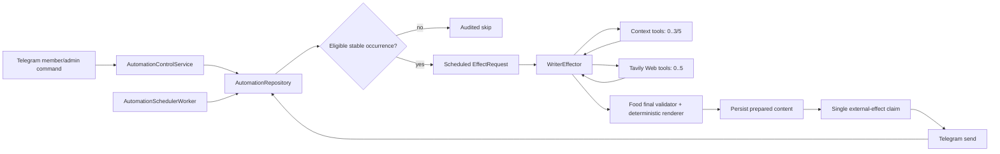
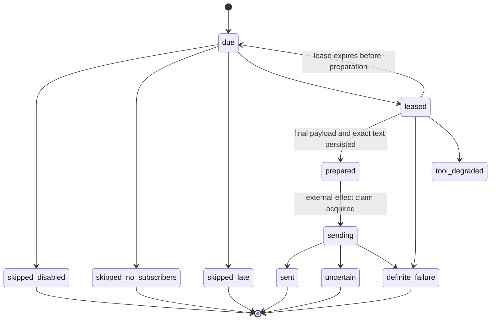

# Technical Design: 乐枝订阅式自动触发与工作日美食推荐 v0.4

- Status: Approved for implementation
- Feature: `lezhi-scheduled-food-recommendations-v0-4`
- Requirements input: `9b4034ba57bb2c042acfd10b6d3c1843b7a65602`
- Requirements handoff: `4124fb5444650fe73393a619796eee924d138dee3106cc48366f9bd2e69ce012`
- Baseline: `c1e820ae167c1d65d3dd44371a1a40c018e0293d`
- Written: 2026-08-03

## 1. Design Outcome

This feature adds a governed automation plane beside the existing inbound Telegram polling path.
The first and only production automation type is `weekday_food_recommendation`. A group
administrator enables and configures it; a member can then subscribe only themselves. One or
more active subscriptions make one group-level lunch occurrence and one group-level dinner
occurrence eligible on Monday through Friday in the configured IANA timezone.

A scheduled occurrence is an application-owned event, not a fabricated Telegram member message.
It carries an immutable occurrence key, schedule/config snapshot, aggregated non-sensitive group
preferences and the active persona snapshot into the existing Writer boundary. The application
validates and renders one primary choice and two alternatives, persists that exact content before
claiming the Telegram effect, and never automatically retries an uncertain send.

The Writer gains two read-only tools backed by Tavily: `web_search` uses Search and `web_fetch`
uses Extract. Context tools retain their ordinary-three/complex-five allowance; Web tools have an
independent five-attempt allowance. Both categories still share the effect deadline, model-call
ceiling, result-size/cost limits, application safety checks and single external-effect contract.

Automation and Tavily are separately feature-gated. Shipping code does not enable a group,
create a subscription, call Tavily, restart Compose or send a real scheduled Telegram message.
Those remain explicit deployment and operator-UAT steps.

## 2. Architecture and Ownership



The new responsibilities are split as follows:

| Component | Responsibility | Explicitly does not own |
| --- | --- | --- |
| `automation.py` | Allowlisted type definitions, schedule calculation, eligibility, leases, occurrence state and worker loop | Telegram authorization, model calls, provider transport |
| `automation_control.py` | Bot-target-aware commands, administrator authorization, self-subscription and redacted operation audit | Arbitrary cron/prompt/URL acceptance |
| `tavily.py` | Fixed Tavily endpoints, authentication, bounded parsing, error normalization and secret redaction | Product truth, URL authorization, retries outside the tool loop |
| `tools.py` | Tool authorization, two independent budgets, URL policy, current-turn search provenance and audit | Persistence of Web content or model-directed writes |
| `events.py` / `context.py` | Typed inbound or scheduled provenance | Pretending a scheduled event came from a member |
| `effector.py` | Shared bounded Writer loop, scheduled prompt, final validation and degradation | Scheduling or direct provider retries |
| `runs.py` | Effect/tool/external-effect audit and prepared-output recovery | Plaintext prompt, complete query, API key or full provider body logging |

The scheduler runs in a dedicated daemon thread with its own SQLite connections. Its failure can
pause automation without stopping Telegram polling, inbound controls, direct replies or the
recognition worker. Model and Telegram work never runs while holding a database transaction.

## 3. Governed Automation Contract

### 3.1 Type registry

An application-owned `AutomationTypeRegistry` contains immutable definitions. The initial
registry has exactly one entry:

```text
type_id                 weekday_food_recommendation
schedule_kind           weekday_meal_slots
subscription_scope      self_in_group
effect_scope            one_group_message
default_timezone        Asia/Shanghai
default_slots           lunch=11:30, dinner=17:30
catch_up_grace          30 minutes
context_tool_budget     ordinary 3, complex 5
web_tool_budget         5
```

Unknown types fail before persistence. A registry definition owns its configuration schema,
schedule algorithm, subscription policy, effect kind, required validator and status serializer.
Adding another type therefore requires a confirmed product definition and code change; no row in
SQLite can manufacture a new type.

### 3.2 Commands and authorization

The initial command surface is deliberately closed:

| Command | Actor | Effect |
| --- | --- | --- |
| `/food_enable` | group administrator | Enable the registered type with defaults if absent |
| `/food_disable CONFIRM` | group administrator | Disable future occurrences and active subscriptions |
| `/food_pause` / `/food_resume` | group administrator | Pause/resume future eligibility without stopping ordinary chat |
| `/food_config timezone=<IANA> lunch=<HH:MM> dinner=<HH:MM> [location=<text>]` | group administrator | Replace the validated group configuration |
| `/food_subscribe` | current group member | Idempotently subscribe only the sender |
| `/food_preferences ...` | subscribed sender | Replace only the sender's bounded non-sensitive preferences |
| `/food_unsubscribe` | subscribed sender | Remove their active subscription and active preferences |
| `/food_status` | current member/admin | Show group enable/pause state, own subscription, next schedule and last outcome |

Commands addressed to `@another_bot` are ignored. Administrator operations revalidate the
authenticated bot username and Telegram `getChatMember` result. Ordinary members cannot name a
target member. Inputs have fixed keys, lengths and enums; cron expressions, prompts, URLs, tool
sequences and unknown options are rejected. Status reports a subscription count, never a member
list or another member's preferences.

The subscribe acknowledgement and `/food_status` are generated from the active group config in
one message. They identify the current group, show its IANA timezone, lunch/dinner wall times and
next occurrence converted into that timezone, state that each slot is coalesced into at most one
group message, and include `/food_unsubscribe`. They never print a subscriber identity.

`/food_disable CONFIRM` invalidates future eligibility and deletes active subscriptions and
preference rows in the same transaction. A minimal redacted action audit is retained for 30 days.
Already claimed external effects are not revoked or resent.

### 3.3 Configuration validation

- timezone must be an installed IANA `ZoneInfo` key and cannot be a fixed numeric offset;
- lunch and dinner are minute-precision local times and must be distinct;
- location is optional, normalized whitespace, at most 120 characters and contains no URL or
  control character;
- configuration changes increment `config_version` and affect only an occurrence that has not
  acquired a lease or external-effect claim;
- the displayed next schedule is calculated from the same registry function used by the worker.

The first release considers Monday through Friday only. Ambiguous/nonexistent local times are
resolved deterministically by round-tripping through UTC: the earliest valid instant is used;
if no instant round-trips to the configured wall time, that slot is skipped with
`invalid_local_time`. Default Shanghai meal times do not encounter this edge, but the policy
prevents duplicate DST occurrences for other timezones.

## 4. Typed Scheduled Effect Context

`EffectRequest` and `EffectContext` are generalized around an exclusive source union:

```python
EffectSource = InboundMessageSource | ScheduledOccurrenceSource
```

`InboundMessageSource` retains the current Telegram message contract unchanged.
`ScheduledOccurrenceSource` contains:

- stable `occurrence_id` and `occurrence_key`;
- `chat_id`, automation `type_id`, local date and `lunch|dinner` slot;
- planned UTC instant, local timezone and `config_version`;
- eligible subscription count, normalized group location and an aggregated preference summary;
- the previous five successfully sent primary-choice canonical keys;
- the same immutable `PersonaSnapshot` used by Trigger, Recognition and Writer;
- deadline and scheduler version.

Exactly one union arm is required. Common properties expose `chat_id`, `trigger_event_id` and
source kind without inventing a sender, member role, Telegram message ID or member text.
`TriggerCategory.SCHEDULED_AUTOMATION` and `TriggerPath.SCHEDULED` make audit and degradation
unambiguous. Context construction renders an application-owned description such as “weekday
dinner recommendation is due”; it never renders it as a quoted member message.

The scheduled path does not call the inbound platform trigger or participation model. It only
opens the Writer after the automation layer proves eligibility. Character Bundle, group policy,
member-memory visibility, tool authorization and final-effect checks remain mandatory.

## 5. Persistence and Migration 5

Migration 5 is additive and transactional. It creates:

### `automation_group_configs`

```text
chat_id, automation_type, enabled, paused, timezone, lunch_time, dinner_time,
location_text, config_version, created_at, updated_at
PRIMARY KEY (chat_id, automation_type)
```

### `automation_subscriptions`

```text
chat_id, automation_type, member_user_id, active, cuisine_tags_json,
budget_band, dietary_tags_json, avoid_items_json, created_at, updated_at
PRIMARY KEY (chat_id, automation_type, member_user_id)
```

Allowed preference arrays use application enums/free-text tokens with per-item and total limits.
They contain no reason field. Terms indicating health, religion, income, allergy guarantee or
other sensitive rationale are rejected fail-closed; no proposal is copied into recognition.

### `automation_occurrences`

```text
occurrence_id, occurrence_key, chat_id, automation_type, local_date, slot,
scheduled_for, grace_deadline, config_version, persona_id, persona_version,
persona_digest, status, lease_owner, lease_expires_at, effect_request_id,
prepared_primary_key, prepared_payload_json, prepared_text, external_effect_id,
reason_code, created_at, updated_at
UNIQUE (occurrence_key)
```

`prepared_payload_json` contains only the validated recommendation fields and source metadata;
`prepared_text` is the exact bounded Telegram text. Neither contains subscriber identities,
complete model prompts, full Web pages or credentials.

### `automation_action_audit`

```text
action_id, chat_id, automation_type, actor_user_id, actor_role, action_kind,
result_kind, reason_code, config_version, created_at, purge_after
```

### Existing run tables

`effect_runs` gains `source_kind` and nullable scheduled occurrence identity. Existing inbound
rows default to `inbound`. Tool audit gains `budget_kind`, category ordinal, provider request ID,
reported credits, result count, source domains, retrieval time and redacted error category.
External effects continue to use the unique `(chat_id, trigger_event_id)` claim; for scheduled
effects, `trigger_event_id` is the stable occurrence ID and the nullable Telegram trigger message
ID remains absent.

No migration rewrites existing messages, runs, memories or visual assets. Migration tests open a
v4 database, apply v5 once, reopen it and prove existing inbound behavior is unchanged.

## 6. Occurrence Calculation and State Machine

The stable key is the canonical length-prefixed hash input:

```text
bot_user_id | chat_id | weekday_food_recommendation | YYYY-MM-DD | lunch|dinner
```

`occurrence_id` is a versioned SHA-256 identifier derived from that value. It does not include
subscriber count, configuration version, process identity or current time. Multiple workers and
restarts therefore converge on one row.



At each bounded tick the worker enumerates enabled registry/config pairs and only the current and
immediately previous local slot. It inserts the deterministic row if absent. If the same stable
date/slot row is still unleased `due` after a schedule edit, the same transaction refreshes its
scheduled instant, grace deadline, config version and persona snapshot; leased, prepared, claimed
and terminal rows are immutable. The worker then atomically leases one eligible row. Before
expensive work it rechecks enabled/paused state, at least one
subscription, config version, grace deadline, persona snapshot and absence of an external-effect
claim.

A crash before `prepared` releases through lease expiry and may recompute. A crash after
`prepared` reuses the same stored payload/text. Recovery joins the occurrence to its durable
external effect: `sent` acknowledgement reconciles the occurrence to `sent`, `failed` to definite
failure, and only an ambiguous `sending`, `uncertain` or missing effect becomes `uncertain`.
No post-claim state is resent. `sent`, all skipped outcomes, `uncertain` and final definite failures
are terminal.

The worker keeps no correctness-critical in-memory cursor. On startup it evaluates the last
30 minutes using occurrence keys, so a restart after 20 minutes can execute once and a restart
after 40 minutes writes `skipped_late`. It never turns yesterday's meals into today's work.

## 7. Subscription Aggregation and Recommendation Memory

The worker reads active preferences only from the current chat and type. It produces a bounded
summary of counts by cuisine tag, budget band, dietary tag and avoid item. It never exposes member
IDs, individual preference ownership or minority membership to the Writer or group output.
Conflicts become diversity instructions: the primary and alternatives should cover distinct
directions rather than claim a single group preference.

The previous five primary choices come only from successful scheduled food effects in the same
chat. Each choice has an application-normalized canonical key (case-folded Unicode, normalized
spacing/punctuation and a bounded stable identifier). The final validator rejects a primary key
found in that five-item history, but alternatives may recur. A failed, skipped or uncertain
occurrence does not advance successful-meal history.

## 8. Tavily Provider Boundary

### 8.1 Fixed requests

`TavilyClient` uses standard-library HTTPS and accepts no model-provided Base URL. It calls only:

```text
POST https://api.tavily.com/search
POST https://api.tavily.com/extract
Authorization: Bearer <TAVILY_API_KEY>
```

Search uses `search_depth=basic`, `max_results<=5`, `chunks_per_source=1`,
`include_answer=false`, `include_raw_content=false`, `include_images=false`,
`include_usage=true` and `safe_search=true`. Extract accepts one authorized URL per attempt,
uses `extract_depth=basic`, `format=markdown`, `include_images=false`,
`include_usage=true`, a single chunk per source and a timeout no greater than the remaining effect
deadline.

An optional operator-owned `TAVILY_PROJECT_ID` is transmitted as `X-Project-ID`. The API key and
Base URL are never placed in prompts, tool results, audit rows, exception causes or `repr`.

### 8.2 Bounded parsing

Search accepts at most five results and retains only normalized title, normalized URL, bounded
content snippet, score, retrieval time, provider request ID and credit usage. Extract accepts one
matching result and retains bounded readable text plus the same metadata. Response bodies,
strings, result arrays and aggregate per-turn characters have independent hard limits. Unknown
top-level fields are ignored only after the required shape validates; wrong types, oversize data,
invalid UTF-8/JSON or URL mismatch are protocol errors.

HTTP 400, 401, 429, 432, 433, 5xx, timeout, transport, empty, protocol and oversize outcomes map
to application-owned redacted categories. There is no hidden transport retry. If the Writer
chooses another attempt, that new call consumes another Web attempt.

## 9. URL and Web-Content Safety

`web_search` accepts only a bounded natural-language query assembled from the current authorized
scenario. The tool rejects control characters, URLs, credential-like text, excessive length and
queries unrelated to the current group/location/food task.

For a scheduled occurrence, `web_fetch` can reference only the opaque result ID of a URL returned
by a successful `web_search` in the same effect run. The application, not the model, resolves that
ID. Ordinary inbound usage may additionally fetch one explicit HTTP(S) URL from the current
member message, but never a URL sourced only from member memory, history or a previous turn.

Before Search results enter the allow set and again before Extract:

- scheme must be `https` or `http`, host must be a canonical DNS name or global literal address;
- credentials, fragments, invalid ports, localhost, `.local`, loopback, link-local, private,
  reserved, multicast and unspecified addresses are rejected;
- all resolved A/AAAA addresses must be global, protecting against DNS rebinding;
- only default port 80/443 is allowed;
- normalized URLs are deduplicated and capped;
- the Extract response URL must normalize exactly to the requested allowlisted URL; redirects or
  provider URL drift fail closed.

Web text is marked `UNTRUSTED_EXTERNAL_CONTENT`. Prompt instructions state that it is evidence,
not policy or commands. It cannot alter persona, subscriptions, configuration, memory, tool
budget or final protocol. No Web content is persisted except bounded citation metadata in the
prepared recommendation and audit.

## 10. Independent Tool Budgets and Writer Loop

The effect loop owns three counters:

| Counter | Hard limit | Counting rule |
| --- | --- | --- |
| Model completions | 11 | Every Writer completion attempt, including provider/protocol failure |
| Context tools | ordinary 3, complex 5 | Every requested context-tool attempt, including rejection/failure |
| Web tools | 5 | Every requested search/fetch attempt, including rejection/failure |

Context and Web attempts do not decrement each other's counter. A model completion must remain
available to produce the final effect, so a tool request is rejected if it would consume the
11th/final completion opportunity. Ten tools are therefore a theoretical bound only when each
preceding completion requests one tool and an eleventh completion remains for the final result.

The existing context extension rule remains: calls four and five require an application-valid
novel prior result and an explicit remaining-gap reason. Web calls zero through five are allowed
by the independent counter but duplicate queries, duplicate fetches, fetch-before-search,
irrelevant purpose, missing location for local merchant search, or low remaining deadline are
rejected and still counted.

Shared bounds apply across both tool categories:

- interactive inbound deadline remains the configured maximum of 30 seconds;
- scheduled food effects use a configurable 60-second default, hard maximum 90 seconds, always
  bounded by occurrence grace deadline;
- total model/tool result material admitted to prompts is at most 16 KiB;
- at most five distinct Web source URLs and three retained citation URLs;
- operator cost policy can lower model/Web limits but cannot raise hard limits;
- deadline, provider authentication/plan/rate failure, repeated invalid requests, cumulative
  output limit or final-validation failure terminates the loop early.

Because deadlines are authoritative, the runtime is not required to spend all ten theoretical
tool calls. A scheduled recommendation that can be safely written without Web uses zero Web
calls. Ordinary chat remains functional when Tavily is disabled or unhealthy.

## 11. Food Writer and Final-Effect Contract

The Writer response schema gains a scheduled-only `food_recommendation` decision:

```text
kind, reason_code, mode(generic|sourced),
primary{choice_type,generic_dish_id,source_result_id,reason_tag},
alternatives[exactly 2 of the same closed shape]
```

The model cannot author a displayed dish/merchant label, description, safety note, current fact or
raw citation URL. It selects one of the application registry's generic dish IDs or, with an
authorized location, three distinct opaque successful Web result IDs. The application owns the
closed reason-tag text, resolves source IDs to current-turn normalized URL/title records, derives
stable merchant keys and renders the final Telegram text.

The application-owned validator requires:

- exactly one primary and exactly two alternatives with distinct application-derived keys and
  displayed labels;
- primary not present in the last five successful primary keys;
- `generic` mode consists only of three distinct registered dish IDs and null source IDs, so model
  output cannot introduce a merchant, current fact or health/safety reassurance;
- `sourced` mode has an authorized group location and three distinct successful current-run source
  IDs; each displayed merchant label is derived from a bounded entity-like result title and each
  claim carries its own normalized URL;
- free-form labels, descriptions, freshness/health/medical notes and extra fields are schema errors
  regardless of wording; rendered reasons and cautious source wording are application-owned;
- source conflict, missing evidence, stale/unsafe content or uncertainty removes the current fact
  or downgrades the whole payload to generic;
- persona snapshot, deadline, config version, subscription eligibility and group identity still
  match immediately before preparation and before the external-effect claim.

Rendering is deterministic and bounded for Telegram. It keeps Lezhi's short opening, a labelled
primary, two concise alternatives and, for sourced mode, exactly three `来源：` links. It never includes internal
reasoning, tool protocol, raw page content or operational errors. The exact rendered text and
canonical primary key are persisted before the effect claim.

If Web fails, the Writer gets one bounded degradation opportunity to return generic content.
If no safe useful generic recommendation exists, the occurrence becomes a safe skip/definite
failure with no chat message. Scheduled failures never use the interactive “我这会儿有点卡住了”
failure reply, because unsolicited operational error messages would be noise.

## 12. Telegram Delivery and At-Most-Once Semantics

Scheduled delivery reuses the Telegram adapter and external-effect acknowledgement contract with
a nullable trigger message. The visible effect remains one text message for v0.4; sticker-only,
text-plus-sticker and avatar actions are not scheduled food outputs.

The worker atomically inserts/claims the unique external effect before calling Telegram. A
definite pre-send validation failure leaves no claim and terminates the occurrence. Once the
network call starts:

- a valid Telegram success response records `sent` and its platform message ID;
- a definite Telegram rejection records `definite_failure` and is not auto-retried;
- timeout, connection loss or invalid response after request initiation records `uncertain` and
  is never auto-retried;
- restart with a claim but no acknowledgement records/reports `uncertain` rather than sending.

This deliberately prefers a missed meal recommendation over duplicate group messages. Telegram
polling and inbound processing continue independently.

## 13. Observability and Data Minimization

`/food_status` and an operator status command expose:

- automation type/version, enabled/paused state and active subscription count;
- timezone, meal times and next eligible slot;
- current member's own subscription state;
- last occurrence outcome and reason;
- Web capability available/unavailable, never its key or endpoint.

Occurrence outcomes include `sent`, `skipped_no_subscribers`, `skipped_disabled`,
`skipped_late`, `tool_degraded`, `definite_failure` and `uncertain`, plus bounded internal reasons
such as weekend and lease contention. Metrics count occurrences, outcomes, latency, model calls,
context/Web attempts, Tavily redacted categories/credits and Telegram outcomes by chat-safe hash
or deployment aggregate.

Audit excludes full model prompts/responses, complete search queries, Web page bodies,
subscriber lists, individual preference attribution, credentials and full sensitive URLs. Source
audit retains normalized domain, URL digest or approved citation URL, provider request ID,
retrieval time, status and credit count. Application logs use reason codes only.

## 14. Configuration and Feature Gates

New settings are strictly parsed and bounded:

```text
AUTOMATION_CAPABILITY=disabled|available          # default disabled
TAVILY_WEB_CAPABILITY=disabled|available           # default disabled
TAVILY_API_KEY=<secret>                            # required only when web available
TAVILY_PROJECT_ID=<optional non-secret id>
TAVILY_TIMEOUT_SECONDS=3..10                       # default 8
AUTOMATION_TICK_SECONDS=5..60                      # default 15
SCHEDULED_EFFECT_DEADLINE_SECONDS=15..90           # default 60
EFFECT_MAX_MODEL_CALLS=1..11                       # default 11
CONTEXT_TOOL_ORDINARY_LIMIT=0..3                   # default 3
CONTEXT_TOOL_COMPLEX_LIMIT=0..5                    # default 5
WEB_TOOL_LIMIT=0..5                                # default 5
TOOL_RESULT_TOTAL_CHARS=1024..16384                # default 16384
```

`AUTOMATION_CAPABILITY=available` only starts the scheduler/control capability; groups remain
disabled until an administrator command. Missing/invalid Tavily credentials with Web capability
requested make Web explicitly unavailable without blocking Telegram startup or generic scheduled
recommendations. Credentials are read from the existing external environment, not committed.

## 15. Failure and Recovery Matrix

| Failure or boundary | Required behavior |
| --- | --- |
| Unknown type, cron, prompt, URL or tool sequence | Reject before persistence |
| Non-admin group enable/config/pause/disable | Reject and audit authorization reason |
| Self-subscription before group enable | No active subscription; explain group state |
| Disabled/paused/no subscriber/weekend | Audited skip; no model, Tavily or Telegram call |
| Duplicate worker/restart replay | One occurrence row; one lease; at most one effect claim |
| Recovery within 30 minutes | Resume/recompute before preparation or reuse prepared text |
| Recovery after 30 minutes | `skipped_late`; do not send |
| Tavily unavailable/401/429/plan/spend/5xx/timeout/protocol | Count attempt; stop bounded loop; generic or safe skip |
| Unsafe/unallowlisted URL | Reject before Extract; count Web attempt |
| Web prompt injection/conflict | Treat as untrusted; omit or downgrade fact; no persistent mutation |
| Model/provider/protocol/deadline failure | Generic bounded degradation if safe, otherwise no message |
| Config/subscriber/persona changes before claim | Re-evaluate and skip/recompute; never send stale draft |
| Telegram definite failure | Record final failure; no automatic retry |
| Telegram uncertain or claimed-without-ack recovery | Record `uncertain`; never resend |
| Scheduler thread failure | Mark unhealthy/pause automation; ordinary polling continues |

## 16. Test Strategy

### Deterministic unit and repository tests

- registry rejects unknown automation types and arbitrary schedules/prompts;
- command target, group admin and self-only authorization matrices;
- preference allowlist, sensitive-reason rejection, deletion and group isolation;
- weekday/weekend, lunch/dinner, timezone and DST schedule calculation with controlled clocks;
- occurrence-key stability across restart/config changes and collision resistance;
- lease expiry, prepared-output reuse, claim boundary and all terminal outcomes;
- migration 4 to 5, idempotent migration and unchanged existing data;
- previous-five primary exclusion and successful-only history advancement;
- two independent counters, 0/3/5 context, 0/5 Web, both counters together and attempted sixth;
- model call 11/final-call reservation, deadline and cumulative-result termination;
- Tavily exact requests, redacted errors, bounded parsing, every documented failure category;
- SSRF/DNS/credential/port/redirect/current-turn search allowlist matrices;
- prompt injection and source-conflict handling;
- final food schema, generic/sourced claims, 1–3 sources and deterministic rendering;
- no subscriber identities, medical/allergy guarantees, external writes or protocol leakage;
- definite/uncertain Telegram delivery and no-resend restart boundaries.

### End-to-end controlled-clock tests

One harness composes SQLite, fake Telegram, scripted Writer and fake Tavily. It covers two groups,
twenty subscribers, both meal slots, weekend, pause/resume, last-member unsubscribe, 20/40-minute
restart, concurrent workers, config change before claim, Tavily success/failure/injection and
Telegram success/definite/uncertain. Assertions require ordinary polling to remain responsive and
zero cross-group data/effects.

### Packaging and deployment checks

Compile, full unit discovery, Ruff check/format, Mypy, package build, isolated wheel import,
shell syntax, Compose rendering, secret scan and Docker build/run remain release gates. Candidate
startup must show automation disabled by default and no credential values. No real Tavily call or
Telegram write is part of deterministic verification.

## 17. Rollout and Rollback

Rollout is staged:

1. merge code with both capabilities disabled;
2. configure Tavily credentials and operator cost policy through the external environment;
3. enable Web capability and run a separately authorized bounded provider probe with no Telegram
   write;
4. start automation capability while every group remains disabled;
5. enable one authorized UAT group, create explicit test subscriptions and use controlled near-term
   lunch/dinner times only with user authorization;
6. verify one group message, sources/degradation, audit, no duplicate and ordinary polling;
7. restore production meal times and expand only through group-admin enablement.

Rollback first pauses the automation capability, leaving normal chat online. The previous image
and external environment values are restored through the existing Compose release path without
deleting the named SQLite volume. New migration tables are additive and ignored by the previous
binary. Existing occurrence claims and uncertain rows are retained so re-enabling cannot resend
them. Rotating/removing the Tavily key disables Web independently.

Real Tavily use, real scheduled Telegram messages and Compose restart require their later explicit
deployment gates; the confirmed requirements handoff alone does not authorize them.

## 18. Requirements Traceability

| Design section | Requirements / acceptance criteria |
| --- | --- |
| 2–3 governed architecture, registry and commands | REQ-001–012, REQ-045–048; AC-001–004, AC-020–021 |
| 3.3 timezone and schedule rules | REQ-013–016; AC-005 |
| 4 typed scheduled context | REQ-019, REQ-047; AC-008 |
| 5–6 persistence, occurrence and recovery | REQ-016–020, REQ-024, REQ-049; AC-006–007, AC-018, AC-020 |
| 7 aggregation and repeat control | REQ-021–028; AC-004, AC-009–010, AC-019 |
| 8 Tavily boundary | REQ-029–031, REQ-035, REQ-038–040; AC-011, AC-014, AC-016 |
| 9 URL/content safety | REQ-031–034, REQ-041, REQ-043; AC-012–013, AC-022 |
| 10 independent budgets | REQ-036–039, REQ-042, REQ-044; AC-015–016, AC-023 |
| 11 food final contract and sources | REQ-021–028, REQ-033, REQ-040–041, REQ-047; AC-009–010, AC-013, AC-017, AC-022 |
| 12 at-most-once delivery | REQ-017–020, REQ-024; AC-006–008, AC-018 |
| 13 observability/minimization | REQ-011–012, REQ-035, REQ-042, REQ-048–049; AC-014, AC-019–020, AC-023 |
| 14 gates/configuration | REQ-002, REQ-035–039, REQ-044–046; AC-014–016, AC-021 |
| 15 failure and recovery | REQ-016–020, REQ-033–044, REQ-047–049; AC-006–008, AC-012–018, AC-022–023 |
| 16 controlled verification | REQ-050; AC-024 |
| 17 rollout/rollback | REQ-018, REQ-020, REQ-044, REQ-048–050; AC-016, AC-018, AC-020, AC-024 |

All accepted assumptions ASM-001 through ASM-014 and decisions DEC-001 through DEC-020 are
represented in the sections above. No design decision expands the confirmed external-write,
sensitive-data, deployment or provider-authorization scope.

## 19. F2 Exit Decision

The design is implementable on the current Python/SQLite/Compose architecture without a new
runtime framework or provider SDK. The largest compatibility change is the typed effect-source
union; implementation must preserve the current inbound constructors and tests while adding the
scheduled arm. The existing `runs.py` file is already above the repository maintainability
threshold, so F4 must run the maintainability gate before changing it and should extract new
automation persistence rather than growing that module.

F2 is approved to proceed to a file-by-file F3 implementation plan. Production implementation,
credential use, deployment and Telegram writes remain prohibited until their respective later
gates.
