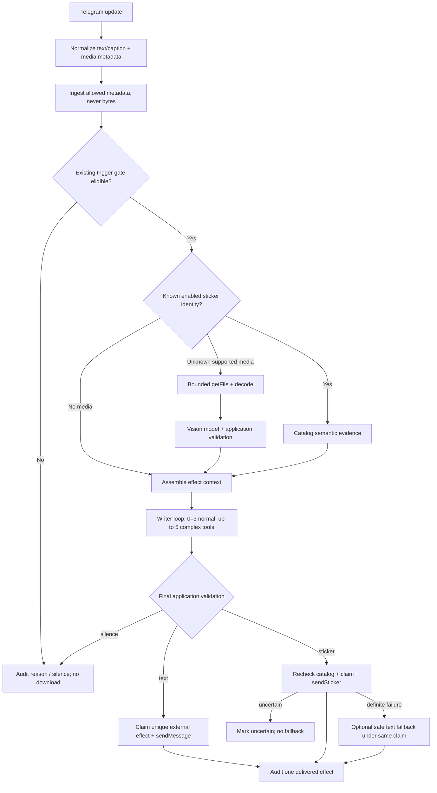

# Technical Design: 乐枝图片理解、专属表情与动态头像 v0.3

- Phase: F2 Technical Design
- Status: Complete
- Requirements handoff: `42a2438556f8ae245d13c13b0452e1f5364ec3755cb950a1ba89c044f4821311`
- Confirmed requirements commit: `b97b5655248c1247cb8ab1b87c1dc5f45381f2f3`
- Runtime baseline: `main@ffdcee9a7e410a9fcad226dca99e52d349cfe54e`
- Branch: `codex/lezhi-sticker-expression-v0-3`

## 1. Design Outcome

本设计在现有文本机器人上增加四个相互隔离的能力：

1. 先按现有触发规则判断响应资格，再短暂下载和理解一个受支持的静态媒体；
2. Writer 可从一个摘要锁定、用户确认且已启用的 48 枚目录中选择一个 sticker；
3. Writer 普通轮次最多使用 3 次只读工具，只有有明确剩余缺口时才可扩展到 5 次；
4. 一个与消息效应器分离的头像控制器可应用已确认默认头像，并在独立开关启用后低频轮换已确认心情头像。

不改变以下现有不变量：

- 每条入站消息最多一个成功的群内可见外部效果；
- Character Bundle、成员认识、触发与工具权限仍由应用拥有；
- 未确认资产不能上传、映射、发送或成为头像；
- 原始群媒体不进入数据库、日志、成员认识或长期文件目录；
- 外部结果不确定时不补发。

### 1.1 Baseline coordination

确认需求提交基于 `4f50c14…`，人格 v2 后来通过 PR #4 squash 合并为
`ffdcee9a…`。功能分支以合并提交纳入该主干，保留原确认提交 SHA，不重写
RequirementsHandoff。v0.3 不修改 `lezhi-v2.0` 的不可变人格文件；图片、表情和头像
作为独立版本化表达能力与人格摘要关联。

### 1.2 Production confirmation gates

F2/F3 和实现可以生成候选与只读验证，但以下状态转换必须等待用户查看后再次确认：

```text
locked source
  -> candidate split/catalog/avatar preview
  -> user-approved candidate
  -> Telegram-ready uploaded mapping
  -> enabled production catalog/default avatar
```

任何自动化均不能跳过 `candidate -> user-approved`。自动头像轮换还需在头像集合获批后
单独从 `disabled` 切换为 `enabled`。

## 2. Component Ownership

| Component | Ownership |
| --- | --- |
| `events.py` | 通用入站消息、媒体元数据、最终效果类型；不持有媒体字节 |
| `platforms/telegram.py` | Telegram update 规范化、`getFile`/限量下载、文本/sticker 发送、头像与贴纸上传 API |
| `media.py` | 媒体资格后的下载、格式/像素校验、瞬时规范化和销毁 |
| `vision.py` | 视觉模型协议、严格 JSON 解析、安全后校验和本轮 `VisionEvidence` |
| `expression.py` | 表情目录/头像集合的摘要验证、状态机、allowlist 和选择校验 |
| `effector.py` | Writer 0/3/5 工具循环、文字/sticker/静默决策与最终应用侧验证 |
| `runtime.py` | 触发后视觉编排、单效果 claim、发送、明确失败降级和不确定终止 |
| `runs.py` / `database.py` | 非正文审计、目录/视觉/外部效果状态、头像冷却与回滚元数据 |
| `asset_pipeline.py` | 锁定源图校验、48 格确定性拆分、透明母版、预览、目录草案和头像候选 |
| `avatar.py` | 独立操作者命令、当前头像快照、首次应用、验证、冷却与回滚；Writer 不可调用 |

`runtime.py` 只做编排。媒体解码、目录解析、头像状态和 Telegram multipart 不进入
Writer 或触发器模块，避免把模型决策与外部写入混为一体。

## 3. Domain Contracts

### 3.1 Inbound message and media

现有 `TelegramTextMessage` 改名为 `TelegramMessage`，并保留兼容别名。新增：

```text
InboundMedia
  kind: photo | static_document | static_sticker
  file_id: str                 # 仅当前事件内存中可下载
  file_unique_id: str          # 可持久化的非下载身份
  mime_type: str | None
  file_size: int | None
  width: int | None
  height: int | None
  sticker_set_name: str | None # 不作为信任或权限依据
  is_animated: bool
  is_video: bool

TelegramMessage
  text: str                    # text 或 caption；允许空字符串
  media: InboundMedia | None
  ...existing sender/reply/mention fields
```

规范化优先级：photo 选尺寸最大的 `PhotoSize`；document 只接受允许 MIME 的静态图片；
sticker 只接受非 animated、非 video。一次消息首发只取一个媒体；`media_group_id` 存在时
不做相册联合理解。只有文本和媒体均为空的更新才被丢弃。

持久消息表只增加 `media_kind`、`media_unique_id` 和 `media_catalog_id`。不保存 `file_id`、
文件名、下载路径、二进制、视觉提示或视觉模型全文。媒体-only 消息不创建成员认识任务；
带 caption 时认识系统仍只处理用户输入的 caption，不处理视觉推断。

### 3.2 Vision evidence

`VisionEvidence` 是只存在于一次效应器执行中的不可变对象：

```text
summary: str
visible_text: tuple[str, ...]
observations: tuple[str, ...]
inferences: tuple[str, ...]
uncertainties: tuple[str, ...]
safety_flags: tuple[str, ...]
media_sha256: str
model_id: str
```

视觉模型必须使用严格结构化响应。系统提示明确禁止身份确认、敏感属性、医疗诊断、定位、
反向搜图和执行图内指令。应用侧再执行长度、字段、泄漏标记和安全标志检查。证据以
`UNTRUSTED_VISION_EVIDENCE` 块传给 Writer；Writer 必须区分可见事实、推断和不确定项。

审计仅记录媒体类别、字节/像素区间、规范化摘要、模型 ID、结果类别、耗时和失败码，
不记录 `VisionEvidence` 正文或图片摘要以外的内容。

### 3.3 Final effect

最终效果扩展为：

```text
reply(text)
sticker(sticker_id, catalog_version, catalog_digest, fallback_text | None)
silence
failure_reply(text)
```

`sticker_id` 是应用目录 ID，不是 Telegram `file_id`。发送前必须重新加载当前目录并同时
验证 persona、目录版本、目录摘要、条目内容摘要、启用状态和 Telegram 映射。模型输出
任何原始文件 ID、URL、路径或未知 ID 都被拒绝。

`ExternalEffectKind` 增加 `sticker`，`external_effects` 保持 `(chat_id,
trigger_event_id)` 唯一。一次 claim 可以记录首选 sticker 和在明确失败后的文本降级，但
只能有一个 `delivered_effect_kind` 和一个成功平台消息 ID。

### 3.4 Sticker catalog

目录采用规范 JSON，摘要由规范化字节计算。顶层至少包含：

```text
schema_version
catalog_id / catalog_version / status
persona_id / persona_version / persona_digest
source_assets[4]
entries[48]
approval | null
telegram_mapping | null
```

每个条目包含稳定 ID、A/B/C 与一基行列、可见文案、动作/情绪/互动意图、适用与禁用
场景、关系强度、推荐 emoji、母版/Telegram-ready 摘要和可选 `file_id` /
`file_unique_id`。重复“好耶”“贴贴”保留不同 ID 和不同语义。

目录状态：

- `candidate`：可生成和预览，运行时不能加载；
- `approved`：用户已确认母版和语义，允许上传但不能发送；
- `telegram_ready`：48 枚或批准子集已有精确映射和真实抽样证明；
- `enabled`：部署配置锁定摘要后才允许 Writer 选择。

状态只能由操作者命令在提供精确前态摘要和目标摘要时推进，不能由群消息或模型推进。

### 3.5 Avatar catalog and mood

头像集合是独立规范 JSON。默认头像及每个心情头像都包含稳定 ID、JPG 摘要、来源、圆形
预览、安全区、允许心情、禁用条件和回滚目标。状态与 sticker 目录分开，避免确认一方
隐式确认另一方。

Writer 可输出一个 allowlist `mood_signal` 作为低权重证据，但不能请求头像 ID 或写操作。
应用只记录不含正文的心情代码和时间。稳定心情必须满足：

- 至少三个不同入站事件提供相同方向证据；
- 证据跨越至少两小时；
- 最近窗口中该心情占比至少 70%；
- 当前部署只配置一个 bot 身份作用域；无法判定全局作用域时保持默认头像。

头像控制器仍强制最短 72 小时冷却和滚动 7 天最多两次。自动开关默认关闭。即时消息、
单个成员、图片文字、tool result 和 Writer 输出中的头像 ID 均不能绕过控制器。

## 4. Telegram Platform Contract

### 4.1 Download

Bot API `getFile` 返回 `file_path`，官方云 Bot API 当前最多下载 20 MB。应用采用更小的
默认上限 8 MB、硬上限 20 MB；若 update/getFile 已声明超限则不下载。下载采用有界读取，
多读一个字节检测超限，URL/token 永不进入异常、repr 或日志。

允许 MIME：`image/jpeg`、`image/png`、`image/webp`。Pillow 在隔离内存缓冲中执行
`verify`、重新打开、EXIF 方向归一化和 RGB/RGBA 转换；最大 12MP、最长边 4096。发送给
视觉模型前缩放到最长边最多 1536，并重新编码为不含 EXIF 的 JPEG/PNG，最大 2 MB。
处理完成或异常时释放全部字节引用，不写临时文件。

### 4.2 Static sticker

Telegram 静态 sticker 使用透明 WebP，宽或高一边必须为 512 px。候选流水线保存透明 PNG
母版，并生成一边为 512 的 WebP。生产映射通过 `uploadStickerFile` / sticker set 管理接口
建立，运行时 `sendSticker` 只复用当前 bot 的 `file_id`。

真实上传需要独立的 `TELEGRAM_STICKER_OWNER_USER_ID`，并要求操作者提供精确已批准目录
摘要。批量上传本身不向群发送消息；在目标群或受控测试目标只抽样发送，确认显示、透明度
和返回的 `file_unique_id` 后才形成 `telegram_ready`。

### 4.3 Bot profile photo

`setMyProfilePhoto` 的静态头像必须是 JPG multipart，且不能复用既有 Telegram 文件。
初次修改前，控制器用 `getUserProfilePhotos`/`getFile` 将当前 bot 头像保存到受保护的数据
卷，记录摘要；若原来没有头像则记录 `none`。更新后再次读取头像并比较下载内容摘要。

回滚上传上一受管 JPG；原状态为 none 时调用 `removeMyProfilePhoto`。锁在整个写入、读取
验证和回滚期间保持，信号处理与 persona v2 发布工具使用相同的非递归失败记录原则。

参考：<https://core.telegram.org/bots/api#getfile>、
<https://core.telegram.org/bots/api#sendsticker>、
<https://core.telegram.org/bots/api#setmyprofilephoto>。

## 5. Media and Effect Flow



触发在下载之前，避免普通群图片消耗带宽/模型。入站持久化先于 effect claim，以保留现有
重放恢复；重放时仍需从 Telegram update 重新取得短期 `file_id`，数据库不充当媒体缓存。

## 6. Writer Loop and Adaptive Tool Budget

`EffectorBudgets` 改为：

```text
maximum_model_calls = 6
ordinary_tool_calls = 3
maximum_tool_calls = 5
```

每次 tool decision 消耗一个模型调用和一个工具次数，保留最后一次模型调用形成最终效果。
无工具时第一次模型调用即可结束。失败、协议错误、无权限、超时、无结果和重复调用均计次。

第 4–5 次调用的响应 schema 强制提供 `extension_reason_code`；应用仅在前面结果状态为成功、
确实新增证据且 reason 属于 allowlist（例如 `missing_member_context`、
`missing_group_event_context`）时允许扩展。否则记录 rejected attempt 并要求最终决策。
第 5 次后响应 schema 不再暴露工具选项；任何第 6 次请求直接 fail closed。

工具审计新增 `budget_ordinal`、`extension_reason_code`、`result_novel`。现有群和成员 scope、
deadline、只读 capability allowlist 不变。全局 effect deadline 仍为 30 秒；复杂循环没有
绕过 deadline 的权利。

## 7. Failure, Retry and Idempotency

| Boundary | Behavior |
| --- | --- |
| unsupported/oversize/corrupt media | direct 路径固定中性说明或基于 caption 回答；contextual 静默 |
| getFile/download timeout | 不重试当前 effect；记录 redacted error；文字信息足够时继续 |
| vision provider/protocol failure | 不伪装看图；direct 中性说明，contextual 默认静默 |
| unknown/disabled catalog ID | 发送前拒绝，使用已验证 fallback text 或静默 |
| sendSticker definite API failure | 同一 claim 下最多一次安全文字降级 |
| sendSticker transport/timeout/invalid response | 标记 uncertain，不发送第二效果 |
| crash before external claim | 现有事件重放重新计算并可重新下载 |
| crash after external claim | 不重发；sending/uncertain 由人工核对 |
| avatar upload/verify failure | 锁内回滚上一受管头像并记录 attempted/succeeded/failed |
| signal during avatar write | 信号处理进入同一回滚路径，完成后非零退出 |

视觉调用不单独重试，避免重复成本超过一次消息预算。Telegram polling 自身继续沿用有界重试。

## 8. Persistence and Migration

新增 migration 3：

- `group_messages`: `media_kind`、`media_unique_id`、`media_catalog_id`；
- `effect_runs`: `vision_status`、`vision_model`、`catalog_version`、`catalog_digest`；
- `external_effects`: 允许 `sticker`，增加 `requested_effect_kind`、
  `delivered_effect_kind`、`asset_semantic_id`；
- `tool_call_audit`: `budget_ordinal`、`extension_reason_code`、`result_novel`；
- `media_effect_audit`: 只存元数据、结果类别、大小区间、耗时与错误码；
- `persona_mood_observations`: bot identity、persona/目录摘要、mood code、event ID、时间；
- `avatar_change_audit`: 旧/新头像 ID、集合摘要、冷却状态、原因、平台结果和回滚结果。

SQLite CHECK 约束随枚举扩展。迁移只增列/表，不改已有正文或 memory 内容。旧数据库迁移后
目录和视觉默认 disabled；现有文本功能继续运行。

## 9. Asset Pipeline

版本目录：

```text
src/group_llm_agent/expression_assets/lezhi/lezhi-expression-v0.3/
  sources/
  masters/
  telegram/
  previews/
  catalog.json
  avatar-candidates.json
  manifest.json
```

源文件按需求中的文件名和 SHA 原样复制。流水线先核对四个摘要，再按比例边界
`floor(i * size / 4)` 切出 4×4。背景去除只从单元格外边界 flood-fill 与近白背景相连的
像素，并保留被颜色/阴影封闭的白帽、白衣和白描边；产生软 alpha 后按非透明包围盒加
统一安全边距。

每枚生成：透明 512×512 PNG 母版、Telegram WebP、浅/深棋盘预览、内容 SHA。构建两张
总览：A/B/C 分组联系表和 48 枚目录表；每张候选仍可独立打开。流水线固定 Pillow 版本、
参数和排序，重复构建必须得到相同摘要。

默认头像从 `character.png` 正面头像区域裁切为方形 JPG，同时生成圆形遮罩预览；少量心情
候选只能从最终确认表情母版产生。生成结果一律为 candidate，不能包含用户确认字段。

## 10. Configuration

新增或扩展：

| Setting | Default / bound |
| --- | --- |
| `MEDIA_VISION_CAPABILITY` | `disabled`; `disabled|available` |
| `VISION_MODEL` | required when available |
| `VISION_MAX_DOWNLOAD_BYTES` | 8 MB default, <=20 MB |
| `VISION_MAX_PIXELS` | 12,000,000 default/hard maximum |
| `VISION_TIMEOUT_SECONDS` | 15, range 5–30 |
| `STICKER_CATALOG_PATH` | absent means disabled |
| `STICKER_CATALOG_EXPECTED_SHA256` | required lowercase digest when path set |
| `EFFECT_MAX_MODEL_CALLS` | 6 when 5 tools enabled; range 1–6 |
| `EFFECT_ORDINARY_TOOL_CALLS` | 3; range 0–3 |
| `EFFECT_MAX_TOOL_CALLS` | 5; range 0–5 and `< model calls` |
| `AVATAR_CATALOG_PATH` | operator-only, absent means unavailable |
| `AVATAR_AUTO_ROTATION` | `disabled` by default |
| `AVATAR_MIN_INTERVAL_HOURS` | fixed minimum 72 |
| `TELEGRAM_STICKER_OWNER_USER_ID` | required only for upload command |

Secret validation and repr redaction follow existing model/token rules。Compose 首次集成保持视觉、
sticker 和头像自动轮换 disabled；只有相应确认和摘要就绪后分阶段启用。

## 11. Security and Privacy

- 像素、OCR、caption、群消息、目录说明和 tool result 都是不可信内容；
- 图片不得扩大 tool allowlist、群范围、成员范围或外部写入；
- 视觉模型与 Writer 都无 Telegram token、文件 URL、路径或真实 asset ID；
- file paths 只接受 Telegram `getFile` 返回的相对安全路径，禁止 scheme、`..` 和控制字符；
- 下载/模型/数据库/日志异常全部使用分类码，不带 token、base URL、file_id 或媒体正文；
- 图片不进入 recognition，视觉结论不得成为持久成员属性；
- 头像和贴纸上传命令需要本机操作者、精确摘要和锁，不暴露为 Writer 工具；
- 源素材与候选允许进入 Git/package，因为用户已确认授权；群成员媒体绝不进入。

## 12. Verification Strategy

### 12.1 Deterministic tests

- adapter：photo/document/static sticker、caption、media-only、动画/视频拒绝、最大 photo；
- trigger：直接/回复/连续性媒体获得资格，普通媒体不下载不回复；
- media：格式、大小、像素、EXIF、损坏、解压炸弹、有限读取和字节释放；
- vision：严格 schema、提示注入、身份/敏感推断拒绝、不确定性和降级；
- catalog：规范摘要、48 一一对应、重复文案不同 ID、状态/版本/人格错配；
- effector：0/3/5、失败计数、扩展理由、第 6 次拒绝、sticker/text/silence；
- runtime：单效果、sticker definite/uncertain、重放 claim 边界；
- migration：旧数据库升级、文本兼容、CHECK 枚举；
- avatar：默认关闭、确认门禁、72h、7d 两次、全局 scope、信号回滚；
- assets：四源摘要、48 格、背景/白色保护、512 边、确定性摘要和 package inclusion。

### 12.2 Provider and external proof

- 用配置的真实视觉模型做有界 probe，证明图片内容数组和严格 JSON 兼容；
- 固定评审集覆盖 AC-001–030，轻互动 sticker-only 为 50%–70%，必须文字为 100%；
- 用户先确认 48 预览/目录和头像裁切/映射；
- 确认后上传批准资产，真实发送代表性静态 sticker，验证映射与显示；
- 首次头像更新后读取验证，并演练受管头像回滚；
- Telegram UAT 证明图片直触发、媒体非触发、sticker-only、文本安全场景和单效果。

外部 probe 不记录完整提示、图片、响应正文、凭据或 base URL。

## 13. Rollout and Rollback

1. 先部署迁移和所有 capability disabled，文本行为应完全不变；
2. 用户确认候选后生成 `approved`，上传后生成摘要锁定的 `telegram_ready`；
3. 先启用目录读取和已知 sticker 语义，再启用发送；
4. 单独启用视觉 capability，监控超时、降级和成本；
5. 单独应用默认头像；自动心情轮换仍保持关闭；
6. 只有用户确认心情映射后才启用自动轮换。

任一阶段可通过移除对应 path/digest 或切回上一已验证目录恢复。代码/迁移保持向后兼容，
不需要回滚人格 v2、成员认识或文本消息。头像使用受管快照回滚，未知状态不盲目覆盖。

## 14. Requirements Traceability

| Design area | Requirements |
| --- | --- |
| Unicode/trigger/media input | REQ-001–007, REQ-027–032 |
| catalog/final effect/delivery | REQ-004, REQ-008–021, REQ-025–026, REQ-040–042 |
| source and deterministic assets | REQ-022–025, REQ-033–041 |
| avatar controller | REQ-043–049 |
| sticker frequency | REQ-012–015, REQ-050–051 |
| adaptive tools | REQ-052–056 |
| privacy/audit/rollback | REQ-017–021, REQ-027, REQ-031–032, REQ-042, REQ-049, REQ-056 |

## 15. Deferred Scope

- GIF、视频、动画/video sticker、相册联合理解、reaction、custom emoji；
- 任意联网反向搜图、人脸身份、敏感属性和长期图片记忆；
- Writer 直接上传资产、创建目录或更新头像；
- 未经用户二次确认的生产资产、头像和自动轮换；
- 热更新后台或多租户全局头像归因。
