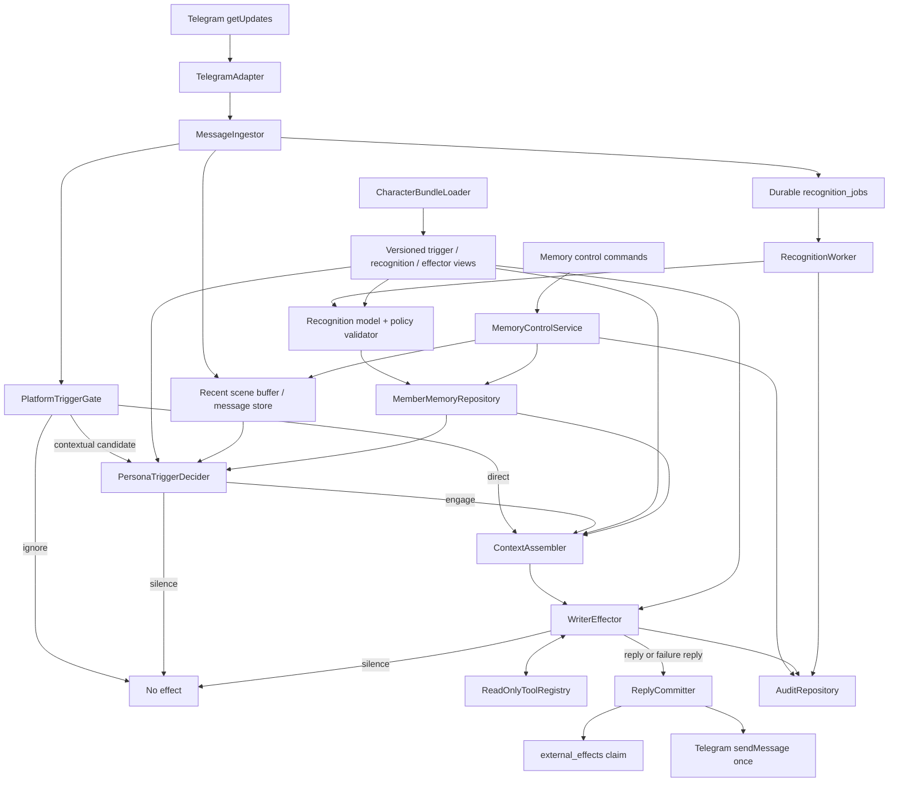
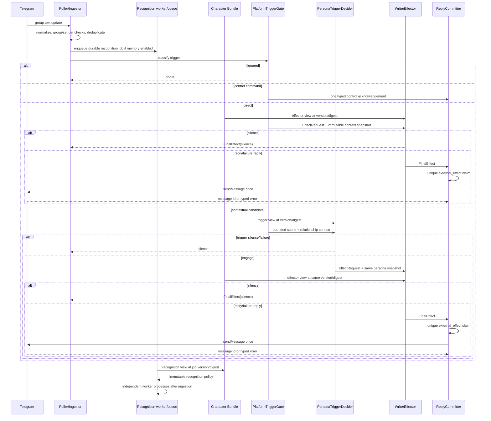

# Design: 原创人格、成员认识与作家上下文能力（第一阶段）

- Lifecycle phase: F2 Design
- Status: Complete; ready for F3 planning
- Requirements source: `docs/feature/maomao-persona-chat/requirements.md`
- Requirements commit: `c5ea34553e52505ff50ee421cc08efff297df01f`
- Requirements handoff: `9d436ac128ed195223045c72be7ac134dff5177d8d4de11f0ad077dc8e223c32`
- Branch: `codex/maomao-persona-chat`
- Updated: 2026-07-29
- F2 revision: Character Bundle explicitly drives Trigger, Recognition and Effector views

> 本文定义拟议实现，不描述已经存在的行为。当前代码仍是 Telegram 群聊固定回复
> `1` 的 0.1 基线。`TASK-PERSONA-001` 尚未形成并确认 Character Bible，因此 F3
> 可以规划通用运行时、存储和测试夹具，但不得实现或启用任何临时生产人格。

## 1. Design Outcome

第一阶段在现有单群 Telegram 长轮询服务上增加四个职责清晰、共享同一人格版本的能力：

1. **Character Bundle**：装载一份用户已确认、不可变且可回滚的原创 Character Bible，
   并为触发器、认识系统和效应器提供同版本的只读视图。
2. **Persona Trigger**：结合平台硬门禁、人格关注点、参与姿态、当前场景和成员关系，
   判断角色是否应当参与。
3. **Member Recognition System**：依据同一人格的关注方式、关系姿态和偏好演变规则，
   异步观察当前公开群消息，形成群隔离、可修订、可重置的成员认识。
4. **Writer Effector**：读取同一人格版本、当前场景、相关成员认识和受控工具结果，
   最多提交一个外部效果。

设计保留以下 0.1 性质：

- 只连接一个由 `TELEGRAM_CHAT_ID` 指定的群；
- 继续使用 Telegram Bot API long polling，不需要公网入站端口；
- 继续使用 SQLite 作为本地持久化；
- 所有发送都先进行持久化 claim，选择 at-most-once 而不是自动重发；
- Telegram transport error 和凭据继续按脱敏类别处理。

设计不做以下事情：

- 不定义原创角色名称、背景、口吻、关系姿态或样例；
- 不固定为三次工具机会，也不引入复杂情绪状态机；
- 不引入跨群记忆、私聊记忆、向量数据库或外部写工具；
- 不把每日事件摘要作为首发必需能力；
- 不提供浏览其他成员内部认识的管理界面或聊天命令。

## 2. Existing Baseline And Change Boundary

| Existing component | F2 decision |
| --- | --- |
| `TelegramBotApiClient` | 保留；增加管理员身份查询和返回已发送消息 ID 的窄接口。 |
| `TelegramAdapter` | 保留；扩展 reply-to、bot command 和稳定成员标识的归一化。 |
| `TelegramPollingService` | 保留网络重试职责；处理器替换为组合式 `GroupRuntime`。 |
| `FixedReplyProcessor` | 保留为默认兼容模式；人格模式启用后由新运行时替代。 |
| `SQLiteDeliveryLedger` | 保留旧数据；新外部效果使用更严格的单触发唯一账本。 |
| `Settings` | 继续从环境读取；新增人格模式、模型、预算和记忆能力开关。 |
| Docker Compose | 保留单服务和持久卷；同一进程内增加一个后台认识 worker。 |

不从共享 checkout 中未提交的原型模块复制接口或数据表。F3 以当前提交中的正式
0.1 模块为迁移基线。

## 3. Architecture And Ownership



| Component | Owns | Must not do |
| --- | --- | --- |
| `MessageIngestor` | 去重、即时上下文、启用后短期文本持久化、认识任务入队。 | 决定是否回复或生成成员认识。 |
| `PlatformTriggerGate` | 直接触发识别、情境候选硬门限、控制命令路由。 | 根据人格写回复、调用模型或更新长期认识。 |
| `PersonaTriggerDecider` | 使用 Character Bundle、场景和关系认识决定情境候选是 engage 还是 silence。 | 生成最终台词、调用工具或修改长期认识。 |
| `CharacterBundleLoader` | Schema、版本、内容 digest、启用清单校验，以及三个一致只读视图的编译。 | 静默补充角色内容、产生可独立漂移的副本或在线改写人格。 |
| `ContextAssembler` | 为触发判定和效应器分别装配最近场景与最小必要成员认识。 | 写认识或越过当前群读取数据。 |
| `WriterEffector` | 驱动有界模型循环，返回 reply、silence 或 typed failure。 | 永久修改成员认识或直接调用 Telegram。 |
| `ReadOnlyToolRegistry` | 工具注册、参数校验、群范围、预算和审计。 | 注册外部写工具或把工具结果当作可信指令。 |
| `ReplyCommitter` | 单触发 claim、发送、结果状态和出站消息入库。 | 生成内容或自动重试不确定发送。 |
| `RecognitionWorker` | 独立消费持久队列并提出认识变更。 | 生成 Telegram 回复或阻塞 polling/effector。 |
| `RecognitionPolicyValidator` | 来源、封闭安全语义、类别、置信度、版本和 reset barrier 校验；由应用生成持久化文本。 | 相信模型给出的群、成员、source ID 或自由文本认识。 |
| `MemberMemoryRepository` | 认识项、来源、修订、撤销、有效置信度和群隔离。 | 返回其他群或已重置内容。 |
| `MemoryControlService` | 启用说明、禁用、自助/管理员重置和权限检查。 | 披露内部认识或在权限不确定时执行。 |
| `AuditRepository` | 记录结构化运行、工具、认识变更和重置元数据。 | 保存 token、完整 prompt、思维链或无界消息正文。 |

“作家”是 Character Bible 以及它对触发选择、成员认识和最终表达的共同约束，不要求新增一个
名为 `Writer` 的独立长期状态组件。

## 4. Core Runtime Contracts

以下为内部 typed contracts。F3 可以使用 frozen dataclass、enum 和 protocol 表达，字段语义不得
在实现中静默改变。

### 4.1 NormalizedGroupMessage

```text
NormalizedGroupMessage
  event_id                 # Telegram update_id; stable ingestion id
  chat_id
  message_id
  sender_user_id           # Telegram user id; username is never an identity key
  sender_display_name      # mutable display-only alias
  text
  sent_at
  mentioned_bot
  replied_to_message_id?
  replied_to_user_id?
  is_bot_command
```

`TelegramAdapter` only accepts ordinary text from `group` or `supergroup`. Bot-authored
updates remain excluded from inbound human processing. Outbound bot messages are inserted by
`ReplyCommitter`, not normalized again from Telegram replay.

### 4.2 PlatformTriggerDecision, PersonaTriggerDecision And EffectRequest

```text
PlatformTriggerDecision
  kind                     # ignore | control | direct | contextual_candidate
  reason_code

PersonaTriggerDecision
  kind                     # engage | silence
  reason_code
  persona_version
  persona_digest

EffectRequest
  request_id               # derived from chat_id + event_id
  trigger_path             # direct | contextual
  trigger_reason
  message
  persona_id
  persona_version
  persona_digest
  deadline_at
```

`PlatformTriggerGate` first applies identity, group, command and cadence rules that cannot be
changed by a Character Bundle. Direct triggers are bot mentions, replies to a bot-authored
message, and non-control bot commands. A direct trigger enters the effector without a separate
participation-model call, because confirmed Scenario 1 requires a response attempt. It still
uses the same Character Bundle in the effector and never bypasses delivery, safety or total
outbound-rate limits.

Contextual eligibility uses a deterministic hard gate:

- at least 15 minutes since the last contextual bot reply;
- at least five new human text messages since that reply;
- no pending/sending external effect for the same inbound event.

Passing the hard gate only creates a candidate. `PersonaTriggerDecider` receives a bounded
trigger context containing the Character Bundle's trigger view, recent scene and relevant
member recognition. It makes one structured, tool-free model call and returns `engage` or
`silence`. It does not draft the reply. Failure, invalid output, deadline exhaustion, low
confidence or unclear participation value resolves to `silence`.

`WriterEffector` may still abstain after an `engage` decision if later context or safety
validation shows that no valid reply should be sent.

### 4.3 CharacterBundle

```text
CharacterBundle
  manifest
    persona_id
    persona_version
    schema_version
    content_sha256
    requirements_commit
    confirmed_snapshot_ref
    evaluation_report_ref
  identity_and_stable_facts
  dramatic_engine
  core_traits
  voice_and_interaction_style
  relationship_stance
  preference_evolution
  situational_behavior
  negative_and_safety_rules
  original_examples[]
  evaluation_contract

CompiledCharacterViews
  trigger_policy_view
    attention_and_interest
    participation_and_silence_rules
    relationship_sensitive_engagement
    situational_boundaries
  recognition_policy_view
    member_salience
    relationship_stance
    preference_evolution
    sensitive_and_negative_boundaries
  effector_policy_view
    full_character_contract
```

The production bundle is an immutable directory containing:

```text
manifest.json
character.json
examples.jsonl
evaluation-cases.jsonl
```

Runtime activation requires all files, a matching manifest digest, the expected persona
version, and a non-empty confirmation/evaluation reference. Runtime checks structure and
integrity; it does not invent missing content or decide that an unconfirmed character is
approved.

The three compiled views are deterministic projections of one canonical bundle, not separately
editable prompts. Each carries the same `persona_id`, `persona_version` and content digest:

- the trigger view answers what this character notices and when participation is in character;
- the recognition view answers what has durable relationship value and how impressions or
  preferences may evolve;
- the effector view answers how the character acts and speaks in the selected scene.

Platform authorization, group scope, cadence minimums, sensitive-attribute prohibitions and
external-write restrictions remain higher-priority runtime rules and cannot be weakened by
any view.

### 4.4 MemberMemoryItem

```text
MemberMemoryItem
  memory_id
  chat_id
  member_user_id
  category                 # fact | observation | impression | shared_experience | preference
  statement                 # application-rendered canonical text, never model-authored
  stored_confidence        # decimal in [0, 1]
  effective_confidence     # calculated at read time
  first_observed_at
  last_supported_at
  updated_at
  status                   # active | superseded | revoked
  recognition_policy_version
  persona_version?         # required for impression and subjective preference
  revision
  source_refs[]
```

Facts, observations and impressions are not interchangeable. Impressions and subjective
preferences always carry the persona version that owns that point of view and cannot be
rendered as objective facts. Facts, observations and shared experiences may remain
persona-neutral. Every item has at least one validated source reference.

### 4.5 EffectorDecision And FinalEffect

```text
EffectorDecision
  kind                     # call_tool | reply | silence
  tool_name?
  tool_arguments?
  tool_purpose_code?
  text?

FinalEffect
  kind                     # reply | silence | failure_reply
  text?
  reason_code
  persona_version
  used_memory_ids[]
  used_tool_call_ids[]
```

The model never returns a Telegram action. `ReplyCommitter` is the only component allowed to
translate `reply` or `failure_reply` into `sendMessage`.

### 4.6 RecognitionProposal

```text
RecognitionProposal
  subject_user_id
  operation                # add | strengthen | revise | weaken | revoke
  category
  semantic_key             # exact application-owned safe semantic
  confidence
  source_message_ids[]
  supersedes_memory_id?
```

The worker derives `chat_id`, allowed subjects and allowed source IDs from the claimed job.
Model-returned identity or source values outside that envelope are rejected. The model cannot
author persistent statement text. The application resolves an exact `(semantic_key, category)`
pair through an immutable safe registry and renders the canonical `MemberMemoryItem.statement`;
unknown or mismatched keys and any extra free-form `statement` field are rejected before the
persistence boundary.

## 5. Persistence Model

SQLite remains the only durable store. Migrations are additive and recorded in
`schema_migrations`. Existing `delivery_ledger` rows remain readable and are not rewritten.

| Table | Key fields and purpose |
| --- | --- |
| `group_policies` | `chat_id` PK; memory status, notice message, enabled actor/time, persona mode/version, retention configuration. |
| `group_messages` | Unique `(chat_id, telegram_message_id)`; sender, reply refs, direction, optional text, event/sent timestamps, `text_expires_at`, `text_purged_at`. |
| `recognition_jobs` | Unique source job; subject, pending/leased/retry/dead/superseded status, attempt count, lease, next attempt, policy version and captured persona version/digest. |
| `member_memory_items` | Versioned active/superseded/revoked recognition entries scoped by `(chat_id, member_user_id)`. |
| `member_memory_sources` | Links memory items to source message metadata without duplicating raw text. |
| `memory_reset_barriers` | Per group/member `ignore_sources_before` and last reset metadata; prevents queued or old messages from rebuilding cleared memory. |
| `trigger_runs` | Contextual candidate, Character Bundle version/digest, engage/silence result, model status, deadline and reason code. |
| `effect_runs` | Unique request; trigger path, persona version, status, deadlines, model/tool counts and typed outcome. |
| `external_effects` | Unique `(chat_id, trigger_event_id)`; one outward effect across persona, control and failure paths; sending/sent/failed/uncertain. |
| `tool_call_audit` | Effect or recognition owner, capability, purpose, source scope, result category, latency and budget counters. |
| `recognition_change_audit` | Memory ID, operation, source IDs, actor/job, policy/persona version and timestamp; no prompt or chain of thought. |
| `control_action_audit` | Memory enable/disable/reset target, requesting Telegram user, authorization result and outcome. |

### 5.1 Group Isolation

Every message, job, memory lookup, tool query, audit record and reset statement includes
`chat_id`. Repository methods require `chat_id` as an explicit keyword argument. SQLite
constraints and composite indexes always place `chat_id` before member/message identifiers.
No repository API accepts a bare `member_user_id` lookup.

### 5.2 Raw Text Retention

- Persistent member recognition is disabled by default.
- While disabled, only an in-memory ring buffer of at most 20 ordinary messages exists.
- After the transparency workflow succeeds, eligible public group text is stored with a
  default seven-day expiration.
- The retention worker replaces expired `text` with `NULL` and sets `text_purged_at`; source
  identifiers, author, timestamps and hashes remain for audit/provenance.
- Tools never return purged text.
- A member reset immediately purges still-retained text authored by that member in the current
  group and creates a reset barrier.

This keeps provenance after the short raw-text window without retaining the original content
indefinitely.

### 5.3 Memory Confidence And Staleness

At read time:

```text
effective_confidence =
  stored_confidence * 0.5 ** (age_days / category_half_life_days)
```

Initial half-lives:

| Category | Half-life |
| --- | --- |
| fact | 180 days |
| shared experience | 180 days |
| observation | 60 days |
| impression | 30 days |
| preference | 30 days |

Items below `0.35` effective confidence are excluded from effector/tool context. An item may be
strengthened only by new validated evidence. Contradicting evidence creates a revision that
supersedes, weakens or revokes the old item; the old item remains audit-only.

These are initial technical defaults delegated to F2/F3, not Character Bible content. They
remain configurable only within tested bounds and changes require a recognition-policy version.

## 6. Message And Effect Lifecycle



Important ordering:

1. Message persistence and recognition-job enqueue are one short transaction.
2. One inbound event captures one immutable persona snapshot. Trigger and effector use that
   exact version/digest; the recognition job records it for independent processing.
3. Effector context uses the last committed recognition snapshot; the current message is not
   allowed to rewrite memory before its own reply.
4. Recognition processing is independent and may finish before or after later messages.
5. A trigger or recognition failure never stops long polling; a contextual trigger failure is
   `silence`, and a recognition failure never changes the effect outcome.

## 7. Character Context And Tools

### 7.1 Deterministic Default Context

`ContextAssembler` produces two bounded snapshots from one captured persona version:

- `TriggerContext` contains the trigger policy view, recent scene, sender/reply-target
  relationship summaries and hard-gate reason. It contains no tools or reply-writing examples.
- `EffectContext` contains the effector policy view and the richer context below.

`EffectContext` includes without a tool call:

- the current normalized message;
- at most 20 recent ordinary messages from the target group, including stored bot replies;
- active memory for the sender;
- active memory for a replied-to or explicitly mentioned current-scene member;
- the immutable Character Bundle and current trigger path;
- remaining time, model-call and tool-call budgets.

Memory selection is deterministic: current group, allowed subject, active status, compatible
persona/policy version, effective confidence at least `0.35`, then relevance and recency. The
trigger and effector prompts receive bounded memory views and source metadata, not unrestricted
database rows.

### 7.2 First-release Read-only Tools

| Capability | Purpose | Scope and hard result bound |
| --- | --- | --- |
| `lookup_member_memory` | Retrieve additional relevant recognition for a member already present in the current scene. | Current group; allowed scene member IDs only; max 8 items. |
| `search_recent_group_messages` | Recover a specific recent interaction or fact not present in the last 20 messages. | Current group; unpurged text within 7 days; max 10 hits / 4,000 characters. |

Daily-event summaries, web lookup, vector search and other tools remain extensions. They enter
the registry only after an evaluation shows measurable benefit and they inherit the same
source, group, budget, audit and external-write boundaries.

### 7.3 Tool Security Contract

- Tools are registered in code with typed argument/result schemas.
- The model supplies purpose and arguments, never group scope or credentials.
- The registry injects `chat_id`, allowed member IDs, deadline and caller identity.
- Tool results are data, not instructions; prompts delimit and label them untrusted.
- Invalid arguments consume one attempted tool call and return a typed error.
- No shell, filesystem write, Telegram send/delete/moderation or arbitrary URL tool is
  registered in phase one.
- Tool calls can be skipped entirely.

## 8. Persona Trigger And Bounded Writer Effector

### 8.1 Persona Trigger Decision

Only a contextual candidate invokes the persona trigger model. It receives the immutable
`trigger_policy_view`, bounded recent scene, relevant relationship memory and the hard-gate
reason. It has no tools and cannot emit user-facing text.

| Trigger budget | Default / hard cap |
| --- | --- |
| Model calls per contextual candidate | maximum 1 |
| Tool calls | 0 |
| Wall time | 5 seconds |
| Result | structured `engage` or `silence` |

The trigger decision must identify the same persona version/digest captured for the event.
Timeout, provider failure, invalid structure, version mismatch or uncertain value returns
`silence`. Direct triggers do not pay this extra call and continue to the effector.

### 8.2 Writer Effector

The first-release hard budget is:

| Budget | Default / hard cap |
| --- | --- |
| Model calls per effect | maximum 3 |
| Tool calls per effect | maximum 2 |
| Tool calls per model turn | maximum 1 |
| Total wall time | 20 seconds |
| Tool result size | 4,000 characters each |
| Final Telegram text | non-empty, maximum 4,096 characters |

The third model call always receives tools disabled, so every successful run has an opportunity
to turn prior tool results into a final decision:

```text
for model_call in 1..3:
    decision = model(character, scene, memory, prior_tool_results, remaining_budget)

    if decision is reply or silence:
        return validated FinalEffect

    if decision is call_tool and model_call < 3 and tool_calls < 2:
        validate/execute one tool
        append bounded typed result
        continue

    return typed budget_or_protocol_failure
```

One invalid structured writer response may be repaired only if another one of the three calls
remains. There is no retry outside these limits. The persona trigger is a separate participation
decision, not an online personality judge or reply candidate.

The synchronous worst case is three writer calls for a direct event or one trigger call plus
three writer calls for an eligible contextual event. Recognition uses one additional
asynchronous call and never extends the effect deadline.

The model prompt is assembled in this fixed precedence:

1. platform, privacy, safety and output protocol;
2. immutable Character Bundle;
3. current trigger and recent scene;
4. relevant Member Memory views;
5. selected original examples;
6. untrusted tool results;
7. remaining budgets.

User messages, memory statements and tool data can never override layers 1-2. The runtime does
not request or persist chain-of-thought. A short `tool_purpose_code` is allowed for audit.

### 8.3 Final Validation And Degradation

Deterministic validation rejects:

- empty or over-limit text;
- tool/protocol JSON accidentally emitted as user text;
- obvious leakage markers for internal instructions or memory representation;
- a reply decision after the deadline;
- missing or mismatched persona version.

If model, context or validation fails:

- direct path: claim and send at most one configured neutral failure message;
- contextual path: return `silence`;
- no failure path may call tools or the model again after budget exhaustion.

Factual and high-risk content safety remains a higher-priority prompt/runtime policy than
persona or member preference. Production activation additionally requires the Character
Bible evaluation suite to cover these cases.

## 9. Independent Member Recognition

### 9.1 Durable Job Model

When memory is enabled, `MessageIngestor` creates one recognition job for the human sender in
the same transaction as message ingestion. The worker runs in a background thread with a
separate SQLite connection:

1. atomically lease one due job;
2. load only same-group source data after the member reset barrier;
3. load the exact Character Bundle version/digest captured by the job and compile its
   recognition policy view;
4. make one structured recognition-model call outside any database transaction;
5. resolve the exact application-owned safe semantic and validate identities, sources,
   categories and reset boundaries;
6. atomically apply accepted changes with optimistic revision checks;
7. mark the job complete and append audit metadata.

One job makes at most one model call with a 15-second timeout. A transport or provider failure
is retried at most three times with persisted backoff. Exhausted jobs become `dead` and remain
observable. Polling and reply generation continue regardless.

The Character Bundle dependency is intentional:

- persona-neutral facts, observations and shared experiences describe what happened;
- the recognition view determines which events matter to this character;
- impressions and preferences express this character's point of view and therefore bind to
  the captured persona version.

On persona activation or rollback, pending jobs for another persona version are marked
`superseded` rather than allowed to create new subjective memory for the active character.
Existing persona-neutral items remain eligible; old-version impressions and preferences remain
audit-only unless explicitly migrated by a future confirmed policy.

### 9.2 Validation Rules

The validator rejects a proposal when:

- the subject is not the job's `(chat_id, sender_user_id)` or an explicitly validated
  participant in the source event;
- any source message is from another group, purged by reset, older than the reset barrier or
  absent from the job envelope;
- `semantic_key` is unknown, does not match `category`, or the response contains a free-form
  persistent `statement`;
- no application-owned safe semantic represents the evidence. This fail-closed rule covers
  political views, religion, sexual orientation, disease, exact address, financial condition,
  high-impact scores and their paraphrases or named entities without trying to enumerate their
  vocabulary;
- an impression or subjective preference is labeled as fact or lacks the captured persona
  version;
- confidence is out of range, source support is missing, or a one-off message is proposed as
  permanent certainty;
- the group memory policy was disabled or reset after the job was created.

Recognition prompts treat messages as untrusted evidence and have no tools or external-write
capability. The safe registry contains explicit ordinary group behaviors such as supporting a
member, supporting a group plan and joining a group activity, so benign relationship language
does not depend on a generic relation-word blacklist.

### 9.3 Concurrency And Conflict

- SQLite uses WAL mode, foreign keys, a bounded busy timeout and short write transactions.
- Jobs use a lease timestamp so a crashed worker can safely recover expired work.
- Memory updates use `revision` compare-and-swap. A conflict reloads current state and retries
  the database merge once without another model call.
- Reset increments the relevant barrier generation. Any older leased job fails its final
  generation check and cannot recreate cleared memory.
- Preference items from a different persona version are excluded until an explicit migration
  or new evidence creates current-version preferences.

## 10. Transparency, Permissions And Reset

Persistent recognition starts disabled. An environment setting only makes the capability
available; it cannot silently enable a group.

### 10.1 Control Commands

| Command | Actor | Behavior |
| --- | --- | --- |
| `/memory_enable` | current Telegram administrator | Verify live admin status, send the fixed disclosure, enable only after Telegram confirms that message. |
| `/memory_disable` | current Telegram administrator | Stop new persistence/jobs immediately; existing memory becomes unreadable until re-enabled or reset. |
| `/memory_forget_me` | any current human member | Purge that member's current-group recognition and retained authored text; create reset barrier. |
| `/memory_forget_member` as a reply | current Telegram administrator | Reset the replied-to member in this group after live admin verification. |
| `/memory_forget_group CONFIRM` | current Telegram administrator | Reset all current-group recognition and retained raw text in one transaction. |

`getChatMember` is called for administrator actions. Timeout, ambiguous status or insufficient
permission rejects the operation without state change. The bot never reports whether another
member has internal recognition data and never exposes memory contents.

The enable disclosure states that:

- the bot uses messages visible in this public group;
- it may form group-local member recognition that affects future interactions;
- recent raw text has a limited retention window;
- configured model services process this context;
- members can use `/memory_forget_me`;
- administrators can disable or reset the feature.

If notice sending is failed or uncertain, memory remains disabled. A later command with a new
Telegram message may retry the workflow.

### 10.2 Reset Transaction

A reset:

1. increments the group/member reset generation;
2. revokes and removes active derived memory from runtime reads;
3. nulls retained raw text authored by the target in the current group;
4. cancels pending jobs and invalidates leased jobs through the generation check;
5. records actor, target, scope, time and result without recording deleted content.

New messages after the barrier can form new recognition. Other groups and other members are
not changed.

## 11. External And Configuration Contracts

### 11.1 Telegram Port Additions

```text
TelegramPort.send_message(...) -> SentMessage(message_id)
TelegramPort.get_chat_member(chat_id, user_id) -> ChatMemberStatus
```

Both use the existing redacted `TelegramApiError` categories. Sending is not retried after an
uncertain response. `getChatMember` is read-only and receives the configured group ID from the
runtime, never from model output.

### 11.2 Model Port

```text
StructuredModelPort.complete(
  *,
  model_role,              # trigger | writer | recognition
  messages,
  response_schema,
  deadline,
  max_output_tokens,
) -> StructuredModelResult
```

Provider-specific HTTP, authentication and response parsing stay behind this port. Stable
failure categories are `timeout`, `authentication`, `rate_limited`, `invalid_response`,
`provider_error` and `budget_exhausted`. API keys, request URLs containing secrets and raw
provider bodies are never logged.

The F3 adapter serializes the application-owned `response_schema` canonically into a
high-priority system instruction and also supplies the role-specific exact JSON shapes in the
Trigger, Writer and Recognition prompts. Provider `json_object` mode is only the transport
envelope; it is not treated as schema enforcement. The application still performs strict
role-specific parsing and fails closed on aliases, extra fields or invalid decisions. Schemas
are bounded to 32 KiB before any network request.

The concrete provider selection cannot change the contracts, budgets, privacy notice or
failure behavior defined here.

### 11.3 Environment Settings

Existing 0.1 settings remain. New settings:

| Variable | Default | Contract |
| --- | --- | --- |
| `BOT_MODE` | `fixed` | `fixed`, `persona_direct`, or `persona_full`; persona modes require a confirmed bundle. |
| `PERSONA_BUNDLE_PATH` | none | Required in persona modes; immutable readable directory. |
| `PERSONA_EXPECTED_SHA256` | none | Required in persona modes; must match bundle manifest/content. |
| `MODEL_PROVIDER` | none | Required in persona modes; selects a registered adapter only. |
| `MODEL_API_KEY` | none | Secret runtime value; required by the selected provider and never echoed. |
| `WRITER_MODEL` | none | Required in persona modes. |
| `TRIGGER_MODEL` | `WRITER_MODEL` | One structured, tool-free participation decision for contextual candidates. |
| `RECOGNITION_MODEL` | `WRITER_MODEL` | May use the same registered provider/model. |
| `MEMBER_MEMORY_CAPABILITY` | `disabled` | `disabled` or `available`; group activation still requires the notice command. |
| `RAW_MESSAGE_RETENTION_DAYS` | `7` | Integer `1..7`; changing it requires an updated notice/version. |
| `EFFECT_MAX_MODEL_CALLS` | `3` | Integer `1..3`; hard maximum remains 3. |
| `EFFECT_MAX_TOOL_CALLS` | `2` | Integer `0..2`; cannot exceed model calls minus one. |
| `EFFECT_DEADLINE_SECONDS` | `20` | Integer `5..30`. |
| `TRIGGER_DECISION_TIMEOUT_SECONDS` | `5` | Integer `2..10`; failure always becomes contextual silence. |
| `RECOGNITION_TIMEOUT_SECONDS` | `15` | Integer `5..30`. |
| `RECOGNITION_MAX_ATTEMPTS` | `3` | Integer `1..3`. |

Unsafe or inconsistent settings fail startup before any model or Telegram polling call.

## 12. Failure, Retry And Idempotency

| Boundary | Behavior |
| --- | --- |
| Telegram polling failure | Existing redacted retry loop with configured delay. |
| Malformed/unsupported update | Advance offset, log metadata-only reason, continue. |
| Duplicate inbound update | Unique message/event keys prevent duplicate jobs and effects. |
| Character bundle invalid | Persona mode fails startup; fixed mode remains available for rollback. |
| Persona trigger timeout/provider/invalid output | Contextual candidate becomes silence; direct triggers are unaffected. |
| Writer timeout/provider error | Direct neutral failure at most once; contextual silence. |
| Tool invalid/failure/timeout | Typed result within the same budget; no automatic extra turn. |
| Recognition provider failure | Persisted bounded retry; never blocks reply/polling. |
| SQLite busy | Bounded retry for short local transaction; processing failure remains isolated. |
| Send failed before request accepted | Mark failed; no automatic send retry. |
| Send result uncertain | Mark uncertain; never resend automatically. |
| Crash before external-effect claim | Expired effect-run lease may recompute. |
| Crash after external-effect claim | Claim prevents a second send; operator sees sending/uncertain. |
| Reset racing a worker | Barrier generation rejects the stale worker commit. |

`external_effects` has one row per `(chat_id, trigger_event_id)` independent of persona version
and action kind. A redeploy, rollback or mode change can never reply to the same trigger again.
Control commands are consumed before persona triggers, so one command cannot produce both a
control acknowledgement and a character reply.

## 13. Privacy, Safety And Audit Boundary

- Only content visible to the bot in the configured public group is accepted.
- Telegram user ID is the stable identity key; display names and usernames are aliases only.
- No private chat, other group or external profile is merged into recognition.
- Raw text is persisted only after group notice and for at most the configured seven days.
- Memory reads expose the minimum relevant active items, not a complete member dossier.
- Internal memory, confidence, labels and third-person preferences are never returned directly
  to normal chat prompts asking for disclosure.
- The writer may express a Character-Bible-permitted relationship stance, but cannot quote the
  internal memory representation or present preference as fact.
- Logs and audit records contain IDs, versions, category codes, counts, latency and status;
  they exclude bot/model tokens, full prompts, chain-of-thought and provider response bodies.
- External tools are read-only in phase one. Future side-effect categories require a new
  confirmed requirement and runtime permission.

## 14. Compatibility, Migration, Rollout And Rollback

### 14.1 Migration

1. Introduce `schema_migrations` and apply additive tables/indexes.
2. Preserve existing `delivery_ledger` and fixed-reply behavior.
3. Start the recognition worker only when capability is available.
4. Do not create production persona assets until `TASK-PERSONA-001` is confirmed.

Migrations are transactional. Failure leaves `BOT_MODE=fixed` operational against the prior
schema or fails startup before polling; no partial persona mode is reported ready.

### 14.2 Rollout

1. Deploy schema/runtime with `BOT_MODE=fixed` and memory capability disabled.
2. Run deterministic tests and clean-package checks.
3. Confirm and package `TASK-PERSONA-001`; verify bundle digest and offline evaluation report.
4. Make memory capability available; an administrator runs `/memory_enable` so the disclosure
   is visibly posted before persistence begins.
5. Enable `persona_direct` for direct-trigger smoke testing.
6. Enable `persona_full` only after direct behavior, recognition continuity, reset, cadence and
   cross-group isolation proofs pass.

### 14.3 Rollback

- Set `BOT_MODE=fixed` and restart to restore exact 0.1 fixed-reply behavior.
- Disable memory to stop new persistence/recognition; retain or reset existing data according
  to administrator choice.
- Select the previous confirmed Character Bundle and exact digest to roll back persona content.
- Additive tables remain; rollback code ignores them. No down-migration deletes member data
  automatically.

## 15. Verification And Proof Strategy

| Proof group | Requirements / acceptance coverage |
| --- | --- |
| Character Bundle schema, digest, immutable version, three-view compilation and injection tests | REQ-001–006; AC-001–004 |
| Telegram normalization, platform gate, persona trigger dependency and cadence tests | REQ-007–012; AC-003–004 |
| External-effect uniqueness and crash-boundary tests | REQ-009, REQ-012; AC-003–004 |
| Context selection and both local tool contract tests | REQ-013–020; AC-005–008, AC-022 |
| Effector protocol, three-call/two-tool budget and degradation tests | REQ-009–020; AC-003–008 |
| Recognition job, Character Bundle dependency, proposal validator, revision and decay tests | REQ-021–027; AC-009–013 |
| Unknown-member and conflicting-memory fixtures | REQ-025–027; AC-011–013 |
| Group isolation, sensitive-category and disclosure-leak tests | REQ-028–032; AC-014–017 |
| Enable/disable, self/admin reset and reset-race tests | REQ-032–035; AC-017–019 |
| Raw-text expiration and post-restart continuity tests | REQ-022, REQ-034–035; AC-010, AC-019 |
| Read-only registry and future-tool rejection tests | REQ-036–037; AC-020, AC-022 |
| Version/rollback and fixed evaluation-set runner | REQ-038–039; AC-002, AC-021 |
| Existing 0.1 regression suite | Fixed mode, Telegram redaction, polling recovery and packaging compatibility |
| Real-group smoke | Notice, direct reply, selective silence/reply, restart memory, reset and one-effect proof; requires operator credentials. |

Offline evaluation uses the confirmed Character Bible cases and the five-dimensional scorecard.
Every case must score at least `8/10` with zero critical prohibitions before persona mode can be
activated in the real group. Tests use synthetic original fixtures until the production
Character Bible is separately confirmed.

## 16. Requirements Traceability

| Requirement range | Design carrier |
| --- | --- |
| REQ-001–006 | Character Bundle contract, three consistent views, prompt precedence, activation and evaluation gates. |
| REQ-007–012 | Platform/persona trigger contracts, bounded effector, one external effect and degradation. |
| REQ-013–020 | Deterministic context, read-only tools, budgets and audit. |
| REQ-021–027 | Character-aware but independently writing recognition worker, typed memory and revision/decay. |
| REQ-028–035 | Group isolation, non-disclosure, transparency, reset and retention. |
| REQ-036–039 | Read-only registry, version/rollback and release evaluation. |

All AC-001 through AC-022 have an executable proof group in section 15. The concrete test file
map belongs to F3.

## 17. F2 Decisions

- **D-001**：在当前 long-polling 单服务内演进，不增加公网入站或 webhook。
- **D-002**：保留 SQLite，使用 WAL、短事务、后台认识线程和持久 job lease。
- **D-003**：Character Bible 是不可变 bundle；没有已确认 bundle 时人格模式启动失败。
- **D-004**：Character Bible 不在 F2 中填充任何角色内容。
- **D-005**：同一 Character Bundle 确定性编译为 Trigger、Recognition、Effector 三个只读视图，
  每个事件使用同一 persona version 和 digest。
- **D-006**：平台群范围、权限、直接触发和情境频率仍由不可被人格覆盖的硬门禁负责。
- **D-007**：情境候选再进行一次无工具、最多五秒的 Persona Trigger 判定；失败默认静默。
- **D-008**：认识系统和效应器是独立写/读边界；当前消息的认识更新不影响同一次回复。
- **D-009**：认识系统依据 bundle 决定角色关注与关系演变；印象和偏好绑定 persona version。
- **D-010**：最近 20 条消息与关键成员认识为确定性默认上下文，不消耗工具预算。
- **D-011**：首发只提供成员认识查询和七日群消息查询两个本地只读工具。
- **D-012**：效应器最多三次模型调用、两次工具调用，第三次强制禁用工具，总 deadline 20 秒。
- **D-013**：人格门禁主要由版本化 bundle 和离线评测承担；线上不增加第二个评分模型。
- **D-014**：认识 worker 每个 job 最多一次模型调用，失败持久化重试三次，不阻塞 polling/effector。
- **D-015**：认识项以事实、观察、印象、共同经历和主观偏好分类，并在读取时计算衰减置信度。
- **D-016**：持久认识默认关闭，只有管理员成功发布公开说明后才能启用。
- **D-017**：reset barrier 同时阻止排队和并发中的旧任务恢复被清除认识。
- **D-018**：所有 feature 外部效果以 `(chat_id, trigger_event_id)` 唯一，版本切换不能重复发送。
- **D-019**：继续选择 at-most-once；发送结果不确定时不自动重试。
- **D-020**：以 `fixed -> persona_direct -> persona_full` 分阶段启用；模型厂商适配器延后到 F3，
  但必须实现本文包含 trigger、writer、recognition 三种角色的 structured port。

## 18. Remaining Gates

F2 设计不再缺少架构级决策，可以进入 F3 实施计划。但仍有两个明确门限：

1. `TASK-PERSONA-001` 必须在 Requirements 任务形成独立 Character Bible 快照并由用户确认，
   才能创建、实现或启用生产人格内容。
2. F3 必须选择具体模型适配器，列出精确模块、迁移顺序、测试文件和部署文档变更；该选择不得
   改变本文的预算、隐私、失败、群隔离和外部效果合同。
